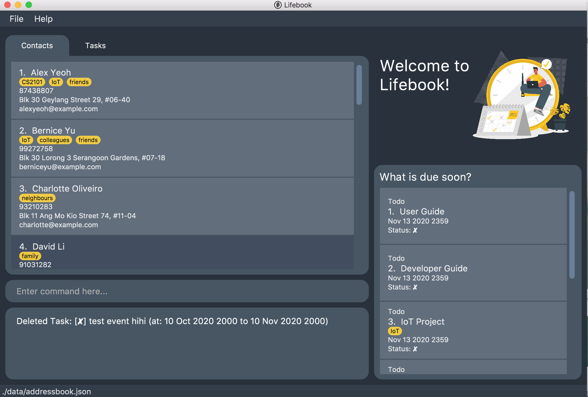

## Lifebook 

**Introduction**

* Lifebook is a project developed for an introductory Software Engineering (SE) module (CS2103T) at the National University of Singapore.

    * Lifebook is a desktop application intended for University students to  manage contact details, assignments, projects, module details, etc.

    * It is written in OOP fashion. It provides a reasonably well-written code base bigger (around 6 KLoC) than what students usually write in beginner-level SE modules, without being overwhelmingly big.

    * It is morphed from AddressBook Level 3 (AB3).

    * It comes with a reasonable level of user and developer documentation.

* For the detailed user documentation of this project, see [here](https://github.com/AY2021S1-CS2103T-F12-4/tp/blob/master/docs/UserGuide.md).

* For contributing to the ongoing development of the Lifebook, do check out the [Developer Guide](https://github.com/AY2021S1-CS2103T-F12-4/tp/blob/master/docs/DeveloperGuide.md).

This project is developed from an se-education.org initiative. If you would like to contribute code to the initiative, see [se-education.org](https://se-education.org#https://se-education.org/#contributing) for more info.

**Acknowledgements**

Libraries used: JavaFX, Jackson, JUnit5
