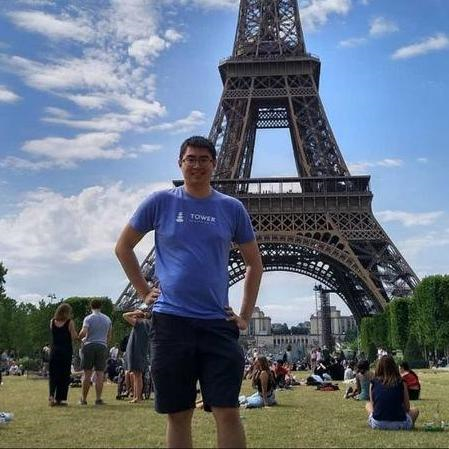
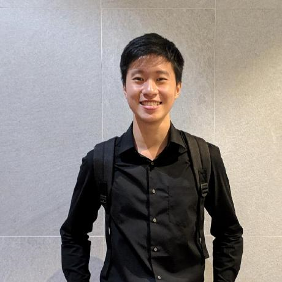
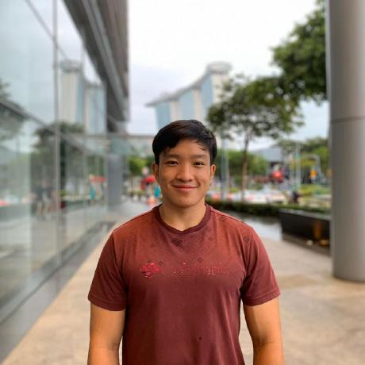
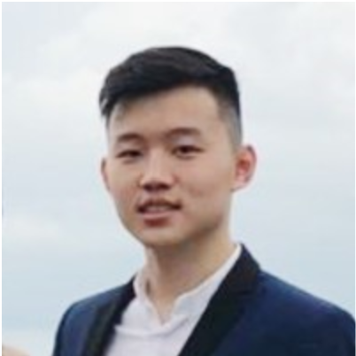

We are a team based in the [School of Computing, National University of Singapore](http://www.comp.nus.edu.sg).

You may reach us through the following email addresses:

* Uriel Tan: urieltan@comp.nus.edu.sg
* Chua Chen Ler: chua.chenler@u.nus.edu
* Kevin William: kevinwilliam@u.nus.edu
* Lucia Tirta Gunawan: luciatirtag@u.nus.edu
* Lin Yuan Xun, Caleb: caleblyx@u.nus.edu

## Project team

### Tan Hong Jie Uriel

[[github](https://github.com/urieltan)]
[[portfolio](team/urieltan.md)]

* Role: Developer Guide, Testing

### Chua Chen Ler

[[github](http://github.com/lerxcl)]
[[portfolio](team/lerxcl.md)]

* Role: Team Lead, Deliverables and deadlines, Scheduling and tracking

### Lin Yuan Xun, Caleb

[[github](http://github.com/caleblyx)]
[[portfolio](team/caleblyx.md)]

* Role: User guide, Intellij expert, Merge conflict solver

### Lucia Tirta Gunawan

[[github](http://github.com/luciatirta)]
[[portfolio](team/luciatirta.md)]

* Role: Testing, Ui Expert

### Kevin William

[[github](http://github.com/kevnw)]
[[portfolio](team/kevnw.md)]

* Role: Integration, Code quality, Github Expert
