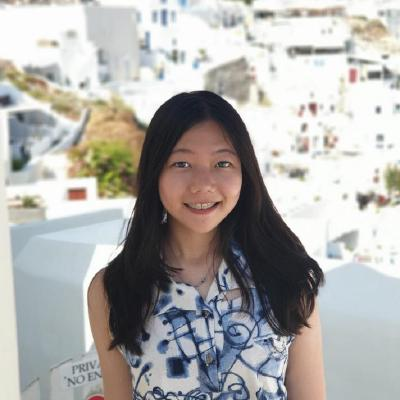

We are a team based in the [School of Computing, National University of Singapore](http://www.comp.nus.edu.sg).

You can reach us at the email `urieltan[at]comp.nus.edu.sg`

## Project team

### Tan Hong Jie Uriel

[[github](https://github.com/urieltan)]

* Role: About Us expert, Developer Guide

### Chua Chen Ler

[[github](http://github.com/lerxcl)]

* Role: Team Lead, Deliverables and deadlines, Scheduling and tracking

### Lin Yuan Xun, Caleb

[[github](http://github.com/caleblyx)] 

* Role: User guide, Intellij expert, Merge conflict solver
* Responsibilities: Data

### Lucia Tirtia Gunawan

[[github](http://github.com/luciatirta)]

* Role: Testing, Ui Expert

### Kevin William

[[github](http://github.com/kevnw)]

* Role: Integration, Code quality, Github Expert
