* Table of Contents
{:toc}

--------------------------------------------------------------------------------------------------------------------

## **Setting up, getting started**

Refer to the guide [_Setting up and getting started_](SettingUp.md).

--------------------------------------------------------------------------------------------------------------------

## **Design**

### Architecture

**How the architecture components interact with each other**

### UI component

The UI consists of a `MainWindow` that is made up of parts e.g.`CommandBox`, `ResultDisplay`, `PersonListPanel`, `TaskListPanel`, `StatusBarFooter` etc. All these, including the `MainWindow`, inherit from the abstract `UiPart` class.

The `UI` component uses JavaFx UI framework. The layout of these UI parts are defined in matching `.fxml` files that are in the `src/main/resources/view` folder.
For example, the layout of the [`MainWindow`](https://github.com/AY2021S1-CS2103T-F12-4/tp/blob/master/src/main/java/seedu/address/ui/MainWindow.java)
is specified in [`MainWindow.fxml`](https://github.com/AY2021S1-CS2103T-F12-4/tp/blob/master/src/main/resources/view/MainWindow.fxml)

The `UI` component,

* Executes user commands using the `Logic` component.
* Listens for changes to `Model` data so that the UI can be updated with the modified data.

**API** :
[`Ui.java`](https://github.com/AY2021S1-CS2103T-F12-4/tp/blob/master/src/main/java/seedu/address/ui/Ui.java)

### Logic component

**API** :
[`Logic.java`](https://github.com/se-edu/addressbook-level3/tree/master/src/main/java/seedu/address/logic/Logic.java)

1. `Logic` uses the `AddressBookParser` class to parse the user command.
2. This results in a `Command` object which is executed by the `LogicManager`.
3. The command execution can affect the `Model` (e.g. adding a person).
4. The result of the command execution is encapsulated as a `CommandResult` object which is passed back to the `Ui`.
5. In addition, the `CommandResult` object can also instruct the `Ui` to perform certain actions, such as displaying help to the user.

Given below is the Sequence Diagram for interactions within the `Logic` component for the `execute("delete contact 1")` API call.

Given below is the Sequence Diagram for interactions within the `Logic` component for the `execute("edit event i/1 ...")` API call.

:information_source: **Note:** The lifeline for `DeleteCommandParser` should end at the destroy marker (X) but due to a limitation of PlantUML, the lifeline reaches the end of diagram.

### Model component
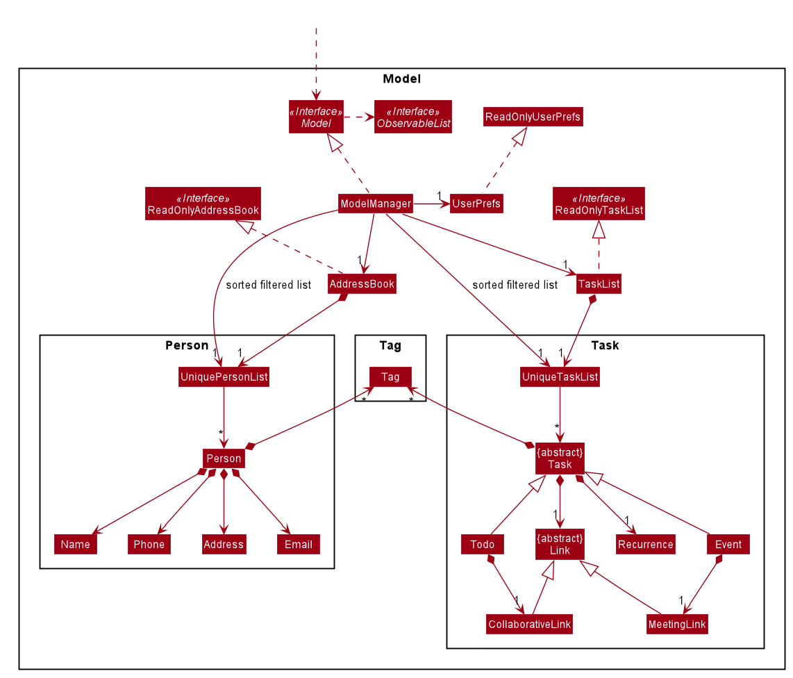
**API** : [`Model.java`](https://github.com/AY2021S1-CS2103T-F12-4/tp/blob/master/src/main/java/seedu/address/model/Model.java)

The Model,
* stores a UserPref object that represents the user’s preferences.
* stores the address book and TaskList data.
* exposes an unmodifiable ObservableList<Person> and an unmodifiable ObservableList<Task>. Both of these lists can be ‘observed’ i.e. the UI can be bound to these lists so that the UI automatically updates when the data in their respective lists change.
* does not depend on any of the other three components.

:information_source: **Note:** An alternative (arguably, a more OOP) model is given below. It has a `Tag` list in the `AddressBook` and `TaskList` , which both `Person` and `Task` references. This allows `AddressBook` amd `TaskList` to only require one `Tag` object per unique `Tag`, instead of each `Person` and `Task` needing their own `Tag` object.

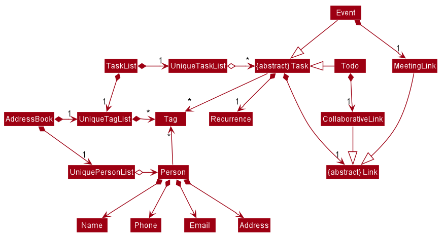
### Storage component

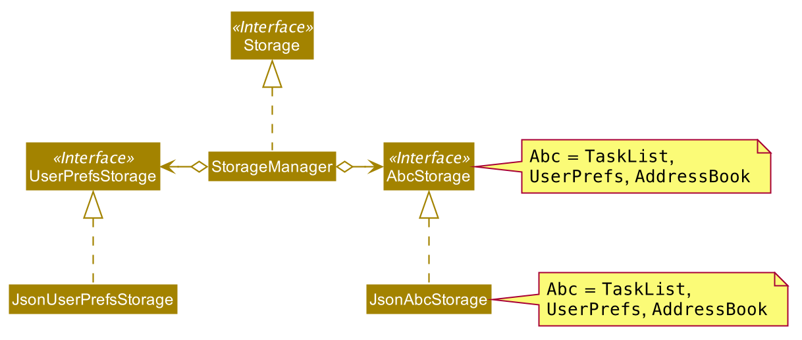

The `UserPrefsStorage` and `TaskListStorage` and `AddressBookStorage` defines the API for reading and saving the Model from and to the computer's memory.
* `UserPrefsStorage` keeps track of `UserPrefs`
* `TaskListStorage` keeps track of `Task` items in the `Model`
* `AddressBookStorage` keeps track of `Person` items in the `Model`
Storage is responsible for keeping the `UserPrefs`, `Task` and `Person` in JSON file format.

The following class diagram shows how `TaskListStorage` makes use of OOP to handle additional data such as Tags and Recurrence, as well as to differentiate between `Task` and `Event`.

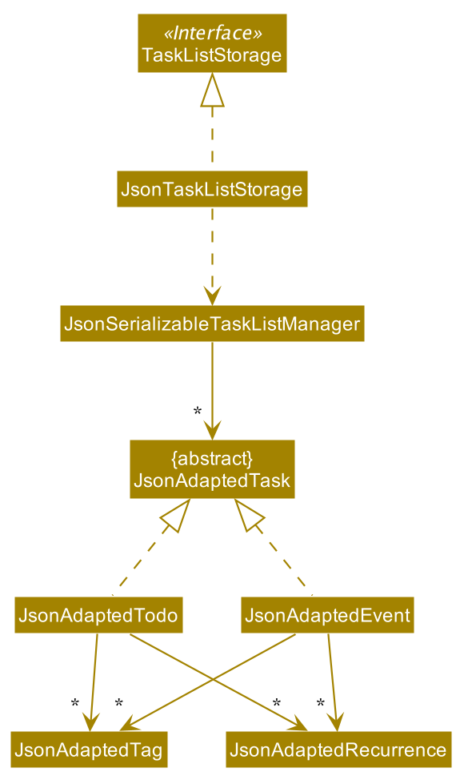

The `AddressBookStorage` class is much simpler and only makes use of `JsonAdaptedTag`, while `UserPrefsStorage` is even simpler and doesn't require it.

These 2 sequence diagrams show a high level view of reading and saving the `Task` from the `LogicManager`.

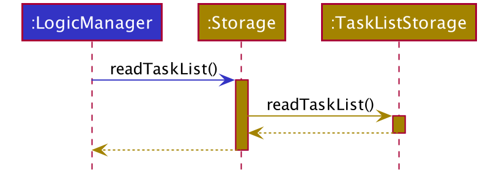
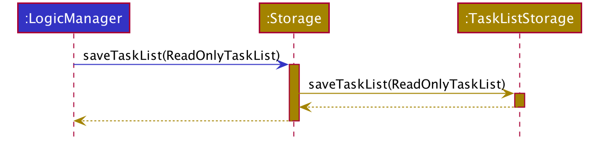

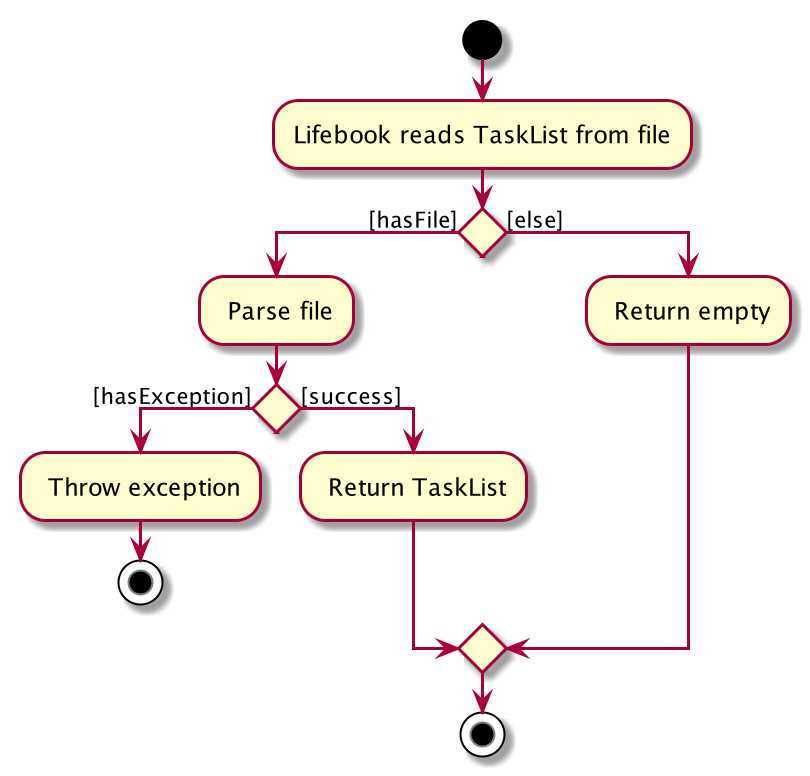

The activity diagram gives a slightly deeper view of how reading `Task` is done.
If the file parsing has issues, an exception will be thrown.

**API** : [`Storage.java`](https://github.com/AY2021S1-CS2103T-F12-4/tp/blob/master/src/main/java/seedu/address/storage/Storage.java)

### Common classes

--------------------------------------------------------------------------------------------------------------------

## **Implementation**

This section describes some noteworthy details on how certain features are implemented.

### Add tasks (`todo` and `event`) feature

##### Parser:

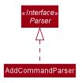

* `AddCommandParser` implements `Parser<AddCommand>`

* It parses the user input to determine if the user intends to add a `todo`, `event`, or `person`.
* It parses the input after the prefixes required to create the intended `todo`, `event`, or `person`.
* If the user input has all all required prefixes and matches the required syntax and format, it creates the new intended Task or `person` and passes it to its respective AddCommand constructor.

##### Command:

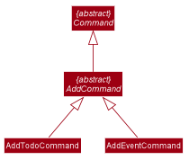

* The abstract class `AddCommand` extends `Command`.
* The concrete classes `AddTodoCommand` and `AddEventCommand` extends `AddCommand`.
* The command will be executed by the Model, which will update the FilteredTaskList based on the added task.
* If it is successful, it will return a CommandResult with a successful message to the UI.

---
The following sequence diagrams displays a `Todo` being added to the TaskList after inputting the following command: `add todo desc/Complete homework date/12-12-2020 time/2359`. Adding an `Event` follows a similar sequence.

The following sequence diagram exhibits the behavior of logic.

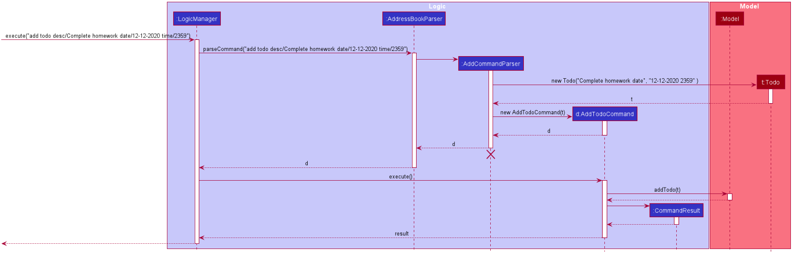
The following activity diagram shows what happens when the user enters an add task command:

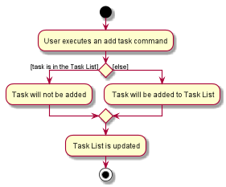

#### Design consideration

#### How command works:

* An alternative approach would be to have a single `AddTaskCommand` which extends `AddCommand`. The `AddCommandParser` could pass either `todo` or `event` to this class' constructor.
* This could reduce the replication of code, since both `AddTodoCommand` and `AddEventCommand` are almost identical.
* However, by having two distinct commands, different and more specific success or error messages can be produced by the execution of respective commands.

### Edit tasks (`todo` and `event`) feature

##### Parser:

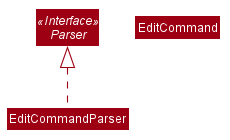

* `EditCommandParser` implements `Parser<EditCommand>`

* It parses the user input to determine if the user intends to add a `todo` or `event`.
* It parses the input after the prefixes required to create the intended `todo` or `event`.
* If the user input has all all required prefixes and matches the required syntax and format, it edits the new intended `Todo` or `Event` and passes it to its respective EditCommand constructor.

##### Command:

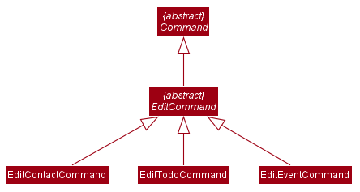

* The abstract class `EditCommand` extends `Command`.
* The concrete classes `EditEventCommand`, `EditTodoCommand`, and `EditContactCommand` extends `EditCommand`.
* The command will be executed by the Model, which will update the FilteredTaskList based on the edited task.
* If it is successful, it will return a CommandResult with a successful message to the UI.

---
The following sequence diagrams displays an `Event` being edited to the TaskList. Editing a `Todo` follows a similar sequence.

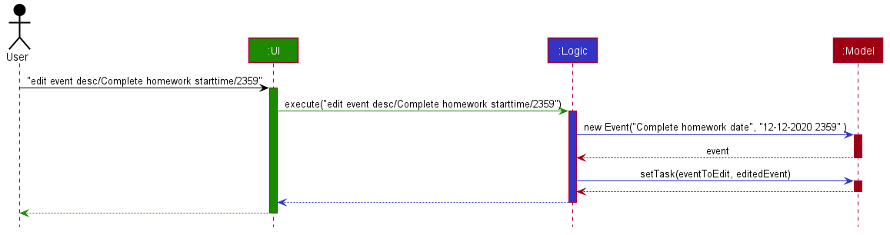

The following sequence diagram exhibits the behavior of logic.

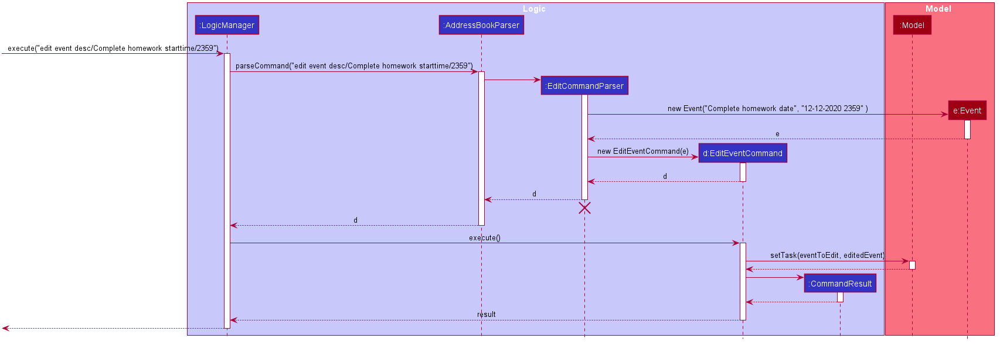

The following activity diagram shows what happens when the user enters an edit task command:

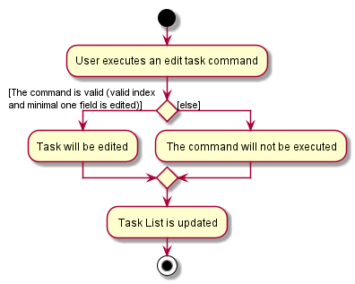

#### Design consideration

#### How command works:

* An alternative approach would be to have a single `EditTaskCommand` which extends `EditCommand`. The `EditCommandParser` could pass either `todo` or `event` to this class' constructor.
* This could reduce the replication of code, since both `AddEventCommand` and `AddTodoCommand` are almost identical.
* However, by having two distinct commands, different and more specific success or error messages can be produced by the execution of respective commands.

### Filter tasks (`dueAt` and `dueBefore`) feature

##### Parser:

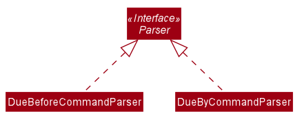

* `DueBeforeCommandParser` implements `Parser<DueBeforeCommand>`

    * It checks for the phrase `itemsDueBefore` and parses the input after the prefixes: date `date/` and time `time/`.
    * If the input are in the correct date and time format, a new DueBeforePredicate object is created and passed
    to a new DueBeforeCommand constructor.

* `DueAtCommandParser` implements `Parser<DueAtCommand>`

    * It checks for the phrase `itemsDueAt` and parses the content after the prefixes: date `date/` and time `time/`.
    * If the input are in the correct date and time format, a new DueAtPredicate object is created and passed to a new DueAtCommand constructor.

##### Predicate:

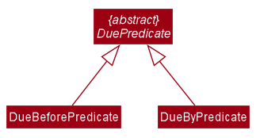

The way dueAt and dueBefore works is very similar, the difference only being the dueBefore and dueAt predicate.

`DueBeforePredicate` and `DueAtPredicate` extends `DuePredicate`.

* `DueBeforePredicate` compares the LocalDateTime input and every task's LocalDateTime, and returns true if the task's LocalDateTime *is before* the input's LocalDateTime.
* `DueAtPredicate` compares the LocalDateTime input and every task's LocalDateTime, and returns true if the task's LocalDateTime *equals* the input's LocalDateTime.

##### Command:
The class diagram

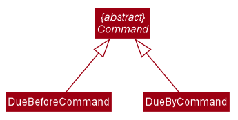

* `DueBeforeCommand` and `DueAtCommand` extends `Command`.
* The command will be executed with the `Model`, which will update the `FilteredTaskList` based on the `DueAtPredicate`/`DueBeforePredicate`
* If it is successful, it will return a `CommandResult` with a successful message to the UI.

The following sequence diagram shows how the dueAt filtering works:

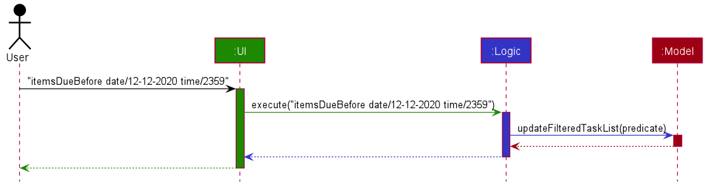

The following activity diagram shows what happens when the user enters the filter command:

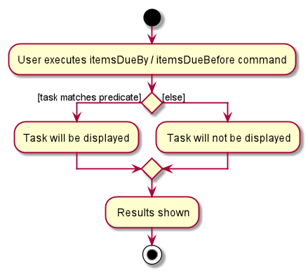

#### Design consideration:

##### Aspect: How dueAt and dueBefore executes

After implementing the task operations, there is `FilteredTaskList` which we can utilise to filter tasks.

By using the same function, we can prevent duplication of code.

Furthermore, we have adhered a similar design to the task's operations (Using of Command, Parser classes) to maintain code consistency.

### Add link to tasks (`link meeting` and `link doc`) feature

##### Parser:

* `LinkCommandParser` implements `Parser<LinkCommand>`

    * It checks for the phrase `link meeting` for LinkMeetingCommand and parses the input
    after the prefixes: desc `desc/`, url `url/`, index `i/`, date `date/DD-MM-YYYY`, and time `time/HHmm`.
    * It checks for the phrase `link doc` for LinkCollaborativeCommand and parses the input
    after the prefixes: desc `desc/`, url `url/`, and index `i/`.
    * If the inputs are all in the correct format, a new Link object is created and added to an existing task.

##### Command:
 The class diagram

-----
The following sequence diagram shows how the LinkCommand works:
* `LinkCollaborativeCommand` and `LinkMeetingCommand` extends `Command`.
* The command will be parsed by `AddressBookParser` and further parsed by `LinkCommandParser`.
* The `LinkCommandParser` will determine whether the command is a `LinkMeetingCommand` or a `LinkCollaborativeCommand`.
* After returning the suitable Link Command, the command will be executed, calling the `setTask()` method of `Model`,
which will update the `TaskList`.
* After updating the task, the `LogicManager` will call `saveLifeBook()` method of `Storage` class to store the update.
* If all are successful, `LinkCommand` will return a `CommandResult` with a successful message to the UI.

The following activity diagram shows what happens when the user enters the link command:

### Find (`find contact`, `find todo`, and `find event`) feature

#### Parser:

* `FindCommandParser` implements `Parser<FindCommand>`

    * It checks for the phrase `find contact` for FindContactCommand and parses the input
    after the prefixes: `n/` and `t/`.
    * It checks for the phrase `find event` for FindEventCommand and parses the input
    after the prefixes: `desc/` and `t/`.
    * It checks for the phrase `find todo` for FindTodoCommand and parses the input
    after the prefixes: `desc/` and `t/`.
    * If the input is correct, a new Predicate object is created and passed to a new FindCommand constructor.

##### Predicate:

The way these predicate works is very similar, where the `ContactMatchesFindKeywordPredicate` handles the Person object
and the `TaskMatchesFindKeywordPredicate` handles the Task object.

`ContactMatchesFindKeywordPredicate` implements `Predicate<Person>`.
`TaskMatchesFindKeywordPredicate` implements `Predicate<Task>`.

* `ContactMatchesFindKeywordPredicate` returns true if the person's name contains one of the name keyword given AND one of the tag matches the given tag keyword.
* `TaskMatchesFindKeywordPredicate` returns true if the task's(event or todo) description contains one of the description keyword given AND one of the tag matches the given tag keyword.
* When only name or description prefix and keyword are given, the predicates return true if the person's name or task's description contain one of the keyword given.
* When only tag prefix and keyword are given, the predicates return true if one of the person's or task's tag(s) matches the keyword given.

##### Command:
 The class diagram

-----
The sequence diagram:
* `FindContactCommand`, `FindEventCommand` and `FindTodoCommand` extends `FindCommand`.
* The command will be parsed by `AddressBookParser` and further parsed by `FindCommandParser`.
* The `FindCommandParser` will determine whether the command is a `FindContactCommand`, `FindEventCommand` or a `FindTodoCommand`.
* After returning the suitable FindCommand, the command will be executed,
calling the `updateFiltertedPersonList()` method of `Model` and update the `AddressBook` if it is a `FindContactCommand`, or
the `updateFiltertedTaskList()` method of `Model` and update the `TaskList` if it is a `FindEventCommand` or `FindTodoCommand`.
* After updating the model, the `LogicManager` will call the storage to save the file.
* If all are successful, `FindCommand` will return a `CommandResult` with a successful message to the UI.

The following sequence diagram shows how the `FindContactCommand` works.
The sequence diagrams for `FindEventCommand` and `FindTodoCommand` are very similar to the diagram below
with minor differences in the type of FindCommand returned and function called to update the model.

The following activity diagram shows what happens when the user enters the find contact command:

The activity diagram when user enters the find event or find todo command is similar to the diagram above.

### Common Tag feature `contactTaskTag`

##### Parser:

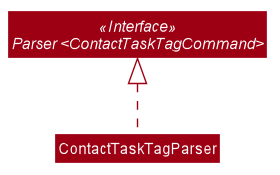

* `ContactTaskTagParser` implements `Parser<ContactTaskTagCommand>`

Upon calling `contactTaskTagParser`, the static classes from `contactTaskTagCommand`: `editEditPersonTags` and `EditTaskTags` will be invoked.

If the person and task index are valid, and there is at least 1 tag given, it returns a new `ContactTaskTagCommand`.

##### Command:

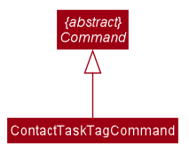

* `ContactTaskTagCommand` extends `Command`.

When the `ContactTaskTagCommand` is being executed, it will retrieve the respective `Person` and `Task`, and update the `Tag` field for both
with the common tag(s) input.

Then, it will update the `FilteredPersonList` and `FilteredTaskList` to reflect the new changes for the `Person` and `Task` in the GUI.

The following sequence diagram shows how the `contactTaskTag` works:

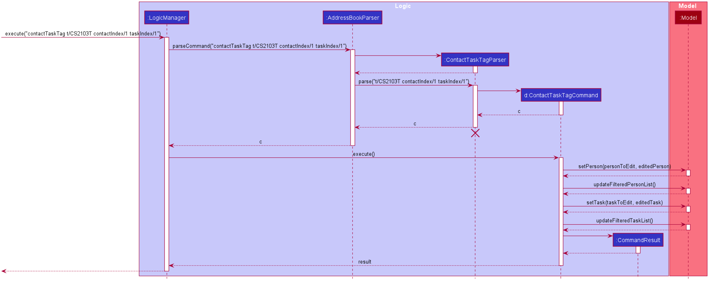

**Full command : "contactTaskTag t/CS2103T contactIndex/1 taskIndex/1"** (Due to space constraints in the sequence diagram)

_Note: The details to of the `Storage` model is being omitted, as it is the same procedure as adding a new contact/task._

Here is an activity diagram which shows the possible scenerios when the user inputs the command:

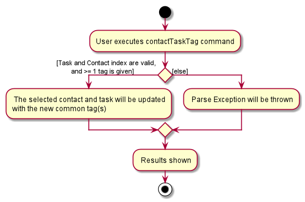

#### Design consideration:

Making use of the `Tag` class is useful in this case, as this will prevent duplication of code, and reduce the chance of bugs.

--------------------------------------------------------------------------------------------------------------------

## **Documentation, logging, testing, configuration, dev-ops**

* [Documentation guide](Documentation.md)
* [Testing guide](Testing.md)
* [Logging guide](Logging.md)
* [Configuration guide](Configuration.md)
* [DevOps guide](DevOps.md)

--------------------------------------------------------------------------------------------------------------------

## **Appendix: Requirements**

### Product scope

**Target user profile**:

* has a need to manage a significant number of contacts
* prefer desktop apps over other types
* can type fast
* prefers typing to mouse interactions
* is reasonably comfortable using CLI apps

**Value proposition**:
* Students can keep track of tasks from all modules they take efficiently.
* Manage contacts faster than a typical mouse/GUI driven app.
* Increase school productivity.
* An all in one app that makes student's life easier.

### User stories

Priorities: High (must have) - `* * *`, Medium (nice to have) - `* *`, Low (unlikely to have) - `*`

| Priority | As a …​                                    | I want to …​                     | So that I can…​                                                        |
| -------- | ------------------------------------------ | ------------------------------ | ---------------------------------------------------------------------- |
| `* * *`  | new user                                   | see usage instructions         | refer to instructions when I forget how to use the App                 |
| `* * *`  | user                                       | add a new person               |                                                                        |
| `* * *`  | forgetful student                          | add todos and events        | remember to complete important tasks for projects and  attend important events|
| `* * *`  | user                                       | delete a person                | remove entries that I no longer need                                   |
| `* * *`  | user                                       | edit a task             |   easily change wrong or outdated information                                                                     |
| `* * *`  | forgetful student                          | remove todos and events        | remove tasks that I no longer need |
| `* * *`  | user                                       | find a person by name or tag          | locate details of persons without having to go through the entire list |
| `* * *`  | user                                       | find todos by description or tag        | locate details of todos without having to go through the entire list |
| `* * *`  | user                                       | find events by description or tag         | locate details of events without having to go through the entire list |
| `* * *`  | student                                    | mark todos and events as done  | remember the tasks or assignments that I have completed          |
| `* *`    | disorganised student                       | add and remove collaborative links (Google Drive, and many more) to a todo   | find the collaborative link for the project easily |
| `* *`      | disorganised student                       | add, remove, and view zoom links for meetings to an event         | remember my Zoom Links                                      |
| `* *`    | forgetful/disorganised student | search what tasks/meetings are due soon or by a specific date/time (filter) | remember to finish before the deadline|
| `* *`    | forgetful/disorganised student | see what tasks are due soon | finish up the most urgent tasks first |
| `* *`    | disorganised student |sort contacts alphabetically | have a more organised contact list to locate contact details more easily|
| `* *`    | disorganised student |sort tasks according to order of imminence | have a more organised task list to select tasks that are most imminent|
| `* *`    | disorganised student |filter the task list to display all tasks, todos, or events | have a complete or more focused view of my Task List |
| `*`      | user with many contacts in the Lifebook | sort persons by name           | locate a person easily                                                 |
| `*`      | student with weekly lectures and tutorials | add recurring tasks         | save time by not adding the same task every week, which is time-consuming|
| `*`      | student                                  | have a common tag for my contact and task | easily find the person I am working with in a project |

### Use cases

(For all use cases below, the **System** is the `Lifebook` and the **Actor** is the `user`, unless specified otherwise)

#### ContactList use cases
**Use case: UC1 Delete a person**

**MSS**

1.  User requests to list persons
2.  Lifebook shows a list of persons
3.  User requests to delete a specific person in the list
4.  Lifebook deletes the person

    Use case ends.

**Extensions**

* 2a. The list is empty.

  Use case ends.

* 3a. The given index is invalid.

    * 3a1. Lifebook shows an error message.

      Use case resumes at step 2.

**Use case: UC2 Adjust sorting of tasks**

1. User requests to apply/remove sorting on a displayed lists of contacts.
2. Lifebook acknowledges by adjusting the sorting on the displayed list of contacts according to the option selected by the user.

    Use case ends.

**Extensions**

* 2a. The displayed list of contacts is empty.
    * 2a1. Lifebook removes all filtering from the list and returns a list sorted according to the option selected by the user.

        Use case ends.

* 2b. The list of contacts is empty (i.e no items were added to the list to be sorted).
    * 2b1. Lifebook displays an error message to prompt the user to add contacts to the list.

        Use case ends.

#### TaskList use cases
**Use case: UC3 Add a Task to the TaskList**

**MSS**
1. User requests to add a Task and its details (i.e. description, dates, and times) to the TaskList.
2. Lifebook acknowledges the request by adding the To Do to the To Do list.

    Use case ends.

**Extensions**

* 1a. User inputs the dates or times of the Task in the incorrect format.

    * 1a1. Lifebook shows an error message

    Use case restarts at step 1.

* 1b. User chooses to input the task as a recurring one

    * 1b1. Lifebook will add the task as a recurring one instead.

**Use case: UC4 Perform an action (delete or mark as done) on a Task from the Tasklist**

**MSS**
1.  User requests for list of all Tasks.
2.  Lifebook shows the requested list of Tasks.
3.  User requests to perform an action on a specific Task from the list
4.  Lifebook performs action on the Task.

    Use case ends.

**Extensions**

* 2a. The list is empty.

  Use case ends.

* 3a. The given index is invalid.

    * 3a1. Lifebook shows an error message.

      Use case resumes at step 2.

* 3b. The given action does not exist.

    * 3b1. Lifebook shows an error message.

     Use case resumes at step 2.

* 3c. The user marks a recurring task as done.

    * 3c1. Lifebook will automatically add a new task with the same details, with a new deadline given by the _recurrence_.

**Use case: UC5 Find contacts by name and/or tag**

**MSS**

1.  User requests to list persons
2.  Lifebook shows a list of persons
3.  User requests to find all persons by name and/or tag
4.  Lifebook displays all the persons who match the searched keywords

    Use case ends.

**Extensions**

* 2a. The list is empty.

  Use case ends.

* 3a. Both the given name and tag is empty.

    * 3a1. Lifebook shows an error message.

      Use case resumes at step 2.
* 3b. The given name or tag is invalid.

    * 3b1. Lifebook shows an error message.

      Use case resumes at step 2.

**Use case: UC6 Find todos by description and/or tag**

**MSS**

1.  User requests to list todos
2.  Lifebook shows a list of todos
3.  User requests to find all todos by description and/or tag
4.  Lifebook displays all the todos that match the searched keywords

    Use case ends.

**Extensions**

* 2a. The list is empty.

  Use case ends.

* 3a. Both the given description and tag is empty.

    * 3a1. Lifebook shows an error message.

      Use case resumes at step 2.
* 3b. The given description or tag is invalid.

    * 3b1. Lifebook shows an error message.

      Use case resumes at step 2.

**Use case: UC7 Find events by description and/or tag**

**MSS**

1.  User requests to list events
2.  Lifebook shows a list of events
3.  User requests to find all events by description and/or tag
4.  Lifebook displays all the events that match the searched keywords

  Use case ends.

**Extensions**

* 2a. The list is empty.

Use case ends.

* 3a. Both the given description and tag is empty.

    * 3a1. Lifebook shows an error message.

      Use case resumes at step 2.
* 3b. The given description or tag is invalid.

    * 3b1. Lifebook shows an error message.

      Use case resumes at step 2.

**Use case: UC8 Filter items due on a specific date/time**

**MSS**

1.  User requests to filter items due by/before a specified date/time
2.  Lifebook shows a list of items that fulfil the requirement.

    Use case ends.

**Extensions**

* 1a. The given index is invalid.

    * 1a1. Lifebook shows an error message.

      Use case restarts at step 1.

* 1b. The given date/time format is invalid.

    * 1b1. Lifebook shows an error message.

        Use case restarts at step 1.

* 2a. The list is empty.

  Use case ends.

**Use case: UC9 Adjust sorting of tasks**

1. User requests to apply/remove sorting on a displayed lists of tasks.
2. LifeBook acknowledges by adjusting the sorting on the displayed list of tasks according to the option selected by the user.

    Use case ends.

**Extensions**

* 2a. The displayed list of tasks is empty.
    * 2a1. Lifebook removes all filtering from the list and returns a list sorted according to the option selected by the user.

        Use case ends.

* 2b. The list of tasks is empty (i.e no items were added to the list to be sorted).
    * 2b1. Lifebook displays an error message to prompt the user to add tasks to the list.

        Use case ends.

**Use case: UC10 Add or remove a collaborative link**

**MSS**

1. User requests a task to be given a link (GitHub Repo, Google Drive, etc).
2. Lifebook acknowledges the request by showing the requested task.
3. User requests to bind the link with the task.
4. Lifebook performs action on the task.

      Use case ends.

**Extensions**

* 1a. The given index is invalid.

    * 1a1. Lifebook shows an error message.

      Use case restarts at step 1.

* 2a. The list is empty.

* 3a. The task already has a link.

    * 3a1. Lifebook requests permission to override the existing link.

      Use case ends.

**Use case: UC11 Store and retrieve a meeting link**

**MSS**

1. User requests a task to be given a meeting link (Teams, Zoom, etc).
2. Lifebook acknowledges the request by attaching a link to the task.
3. User later requests to view meeting links associated with the task.
4. Lifebook shows the links associated with the task.

      Use case ends.

**Extensions**

* 1a. The given index is invalid.

    * 1a1. Lifebook shows an error message.

      Use case restarts at step 1.

* 2a. The list is empty.

* 3a. The task already has a link.

    * 3a1. Lifebook requests permission to override the existing link.

      Use case ends.

**Use case: UC12 Add + search a common tag to a contact and task**

**MSS**

1. User requests to add tag(s) to a particular contact and task.
2. Lifebook acknowledges the request by attaching the tag(s) to the respective contact and task.
3. User then requests to search for the tag in the contact list.
4. Lifebook shows the contact that is associated with the tag.
5. User also requests to search for the tag in the TaskList.
6. Lifebook shows the task that is associated with the task.

    Use case ends.

**Extensions**

* 1a. The given person/task index is invalid.

    * 1a1. Lifebook shows an error message.

      Use case restarts at step 1.

**Use case: UC13 Edit a task**

**MSS**

1. User requests to edit some fields of a task(s).
2. Lifebook acknowledges the request by replacing the field(s) to the respective information.
3. User then requests to search for the tag in the contact list.
4. Lifebook shows the contact that is associated with the tag.
5. User also requests to search for the tag in the TaskList.
6. Lifebook shows the task that is associated with the task.

    Use case ends.

**Extensions**

* 1a. The given person/task index is invalid.

    * 1a1. Lifebook shows an error message.

      Use case restarts at step 1.

* 2a. The list is empty.

* 3a. The user does not give any additional field to be edited.

    * 3a1. Lifebook shows an error message.

      Use case restarts at step 1.

### Non-Functional Requirements

1.  Should work on any _mainstream OS_ as long as it has Java `11` or above installed.
2.  Should be able to hold up to 1000 persons without a noticeable sluggishness in performance for typical usage.
3.  Should be able to hold up to 1000 tasks without a noticeable sluggishness in performance for typical usage.
4.  A user with above average typing speed for regular English text (i.e. not code, not system admin commands) should be able to accomplish most of the tasks faster using commands than using the mouse.
5.  Commands should be intuitive so that users can quickly remember the commands.
6.  Should work without an Internet connection.
7.  Should not require more than 100 MB of storage space.
8.  Should be able to backup and restore data by simply copying the whole Lifebook folder.
9.  A user should be able to switch contact/TaskList with command or by clicking on the GUI.
10. The data saved should be in a human-readable format.

### Glossary

* **Mainstream OS**: Windows, Linux, Unix, OS-X
* **Private contact detail**: A contact detail that is not meant to be shared with others
* **Recurrence**: A task that is done on a fixed interval (day/week/month/year).

--------------------------------------------------------------------------------------------------------------------

## **Appendix: Instructions for manual testing**

Given below are instructions to test the app manually.

:information_source: **Note:** These instructions only provide a starting point for testers to work on;
testers are expected to do more *exploratory* testing.

### Launch and shutdown

1. Initial launch

   1. Download the jar file and copy into an empty folder

   1. Double-click the jar file Expected: Shows the GUI with a set of sample contacts and tasks. The window size may not be optimum.

1. Saving window preferences

   1. Resize the window to an optimum size. Move the window to a different location. Close the window.

   1. Re-launch the app by double-clicking the jar file. 
       Expected: The most recent window size and location is retained.

### Deleting a person

1. Deleting a person while all persons are being shown

   1. Prerequisites: List all persons using the `list contact` command. Multiple persons in the list.

   1. Test case: `delete contact 1` 
      Expected: First contact is deleted from the list. Details of the deleted contact shown in the status message. Timestamp in the status bar is updated.

   1. Test case: `delete contact 0` 
      Expected: No person is deleted. Error details shown in the status message. Status bar remains the same.

   1. Other incorrect delete commands to try: `delete`, `delete contact x` (where x is larger than the list size) 
      Expected: Similar to previous.

### Adding a task (e.g. Todo)

1. Adding on to the TaskList while all tasks are being shown

    1. Prerequisites: List all tasks using the `list task` command.

    1. Test case: `add todo desc/test date/12-12-2020 time/2359` 
       Expected: A todo with the description "test" and deadline "12-12-2020, 2359" is added to the TaskList.

    1. Test case: `add todo desc/test date/12-1-2020 time/259` 
       Expected: The todo is not created as the date and time format is wrong. TaskList should remain the same.
       A "Parse Exception" will be thrown.

    1. Other incorrect add commands to try: `add`, `add todo`, missing description and/or date/time  
       Expected: Similar to previous.

### Editing a Task

1. Editing a task while the TaskList is being shown.
    1. Prerequisites: Have the tasks in the displayed TaskList. The list may be filtered or unfiltered.
    1. Test case: `edit todo i/VALID INDEX ...` e.g. if there is a todo with an index of 5, input the command `edit todo i/5 ...`.  
       Expected: The todo at the index of 5 should be edited according to the input given.
    1. Test case: `edit todo i/2 date/17-12-2020 time/2359`.  
       Expected: The todo at the index of 2 should have the date edited to be `17-12-2020` and the time to be `2359`.
    1. Test case: `edit event i/VALID INDEX ...` e.g. if there is an event with an index of 5, input the command `edit event i/5 ...`.  
       Expected: The event at the index of 5 should be edited according to the input given.
    1. Test case: `edit event i/1 desc/new description startdate/12-12-2020`.  
       Expected: The event at the index of 1 should have the description edited to be `new description` and the starting date to be `12-12-2020`.
    1. Test case: `edit todo i/INVALID INDEX ...` e.g. if the TaskList has 10 items, input the command `edit todo i/12`.  
       Expected: An error message should be provided indicating that the provided index is invalid.
    1. Test case: `edit event i/INVALID INDEX ...` e.g. if the TaskList has 10 items, input the command `edit event i/12`.  
       Expected: An error message should be provided indicating that the provided index is invalid.
           
### Marking a Task as done and Task deletion

1. Marking a task as done or deleting a task while the TaskList is being shown.
    1. Prerequisites: Have tasks in the displayed TaskList. The list may be filtered or unfiltered.
    1. Test case: `done VALID INDEX` e.g. if there is a task with an index of 5, input the command `done 5`.  
       Expected: The task at the index of 5 should be marked as done.
    1. Test case: `delete task VALID INDEX` e.g. if there is a task with an index of 5, input the command `delete task 5`.  
       Expected: The task at the index of 5 should be deleted.
    1. Test case: `done INVALID INDEX` e.g. if the TaskList has 10 items, input the command `done 12`.  
       Expected: An error message should be provided indicating that the provided index is invalid.
    1. Test case: `delete task INVALID INDEX` e.g. if the TaskList has 10 items, input the command `delete task 12`.  
           Expected: An error message should be provided indicating that the provided index is invalid.

### Listing
1. List all contacts, tasks, events, or todos.
    1. Prerequisites: Have tasks and contacts added to LifeBook.
    1. Test case: `list task`  
        Expected: GUI should switch to the task tab (if previously on the contact tab) that displays a complete list of all added tasks.
    1. Test case: `list contact`  
        Expected: GUI should switch to the contact tab (if previously on the the task tab) that displays a complete list of all added contacts.
    1. Test case: `list todo`  
        Expected: GUI should switch to the task tab (if previously on the contact tab) that displays a complete list of only all added todos.
    1. Test case: `list event`  
        Expected: GUI should switch to the task tab (if previously on the contact tab) that displays a complete list of only all added events.

### Finding contacts or tasks
1. Find contacts by name and/or tag
    1. Prerequisites: Have contacts added to Lifebook
    1. Test case: `find contact n/James` 
        Expected: All contacts whose name contains the word 'James'(case-insensitive) will be displayed in the list.
    1. Test case: `find contact t/friend` 
        Expected: All contacts whose one of the tags is 'friend'(case-insensitive) will be displayed in the list.
    1. Test case: `find contact n/James t/friend` 
        Expected: All contacts whose name contains the word 'James'(case-insensitive) AND one of the tags is 'friend'(case-insensitive) will be displayed in the list.
    1. Incorrect find commands to try: `find contact`, `find contact john`
        Expected: Error message of invalid command format will be returned.
2. Find events or todos by description and/or tag
   1. Prerequisites: Have events or todos added to Lifebook
   1. Test case: `find event desc/meeting` 
       Expected: All events whose description contains the word 'meeting'(case-insensitive) will be displayed in the list.
   1. Test case: `find event t/important` 
       Expected: All events whose one of the tags is 'important'(case-insensitive) will be displayed in the list.
   1. Test case: `find event desc/meeting t/important` 
       Expected: All events whose description contains the word 'meeting'(case-insensitive) AND one of the tags is 'important'(case-insensitive) will be displayed in the list.
   1. All three test cases above can be applied to todos by changing the `find event` to `find todo`.
   1. Incorrect find commands to try: `find event`, `find todo assignment`
       Expected: Error message of invalid command format will be returned.            

### Adding a link to a task
Adding a CollaborativeLink to a `Todo` or a MeetingLink to an `Event`.

1. Command: `link meeting`
    1. Prerequisites: Have the tasks in the displayed TaskList. The list may be filtered or unfiltered.
    1. Test case: `link meeting i/VALID INDEX ...` e.g. if there is an event with an index of 5, input the command `link meeting i/5 ...`.  
        Expected: The event at index 5 will now have a link and the GUI will show it.
    1. Test case: `link meeting i/VALID INDEX desc/DESC url/VALID URL date/DATE time/TIME` e.g. if there is an event with an index of 2, input the command `link meeting i/2 desc/Link to Zoom Meeting url/https://www.zoom.com date/20-12-2020 time/1400`.  
        Expected: The event at index 2 will now have a [link](https://www.zoom.com) that has a description, date, and time.
    1. Test case: `link meeting i/VALID INDEX url/INVALID URL FORMAT ...` e.g. if there is an event with an index of 3, input the command `link meeting i/3 url/thisisnotaurl`.  
        Expected: An error message should be provided indicating that the provided url is invalid.
    1. Test case: `link meeting i/VALID INDEX desc/DESC url/VALID URL date/DATE` e.g. if there is an event with an index of 1, input the command `link meeting i/1 desc/Link to Zoom Meeting url/https://www.zoom.com date/20-12-2020`.  
        Expected: An error message should be provided indicating that one of the field is not provided (`time`).

1. Command: `link doc`
    1. Prerequisites: Have the tasks in the displayed TaskList. The list may be filtered or unfiltered.
    1. Test case: `link doc i/VALID INDEX ...` e.g. if there is a todo with an index of 5, input the command `link doc i/5 ...`.  
        Expected: The todo at index 5 will now have a link and the GUI will show it.
    1. Test case: `link doc i/VALID INDEX desc/DESC url/VALID` e.g. if there is a todo with an index of 2, input the command `link doc i/2 desc/Link to User Guide url/https://ay2021s1-cs2103t-f12-4.github.io/tp/UserGuide.html`.  
        Expected: The todo at index 2 will now have a [link](https://ay2021s1-cs2103t-f12-4.github.io/tp/UserGuide.html) that has a description.
    1. Test case: `link doc i/VALID INDEX url/INVALID URL FORMAT ...` e.g. if there is a todo with an index of 3, input the command `link doc i/3 url/thisisnotaurl`.  
        Expected: An error message should be provided indicating that the provided url is invalid.
    1. Test case: `link doc i/VALID INDEX url/VALID URL` e.g. if there is a todo with an index of 1, input the command `link doc i/1 url/https://ay2021s1-cs2103t-f12-4.github.io/tp/UserGuide.html`.  
        Expected: An error message should be provided indicating that one of the field is not provided (`desc`).

### Sorting
Sorting the contact list and TaskList with different states. There are different inputs for each sorting command.

1. Command: `sort task`
    1. Input: Have an unsorted displayed list of tasks.  
       Expected: The list of task should be sorted according to date and time in ascending order.
    1. Input: Have an empty displayed list of tasks due to filtering.  
       Expected: An unfiltered list of tasks sorted according to date and time in ascending order should be displayed.
    1. Input:: Have a TaskList without added Tasks.
       Expected: An error prompting the user to add tasks should be displayed.
   
1. Command: `sort contact`
    1. Input: Have an unsorted displayed list of contacts.  
       Expected: The list of contacts should be sorted according to name in alphabetical order.
    1. Input: Have an empty displayed list of contacts due to filtering.  
       Expected: An unfiltered list of contacts sorted according to name in alphabetical order should be displayed.
    1. Input: Have a contact list without added contacts.
       Expected: An error prompting the user to add contacts should be displayed.

1. Command: `sort clear`
    1. Input: Sorted displayed lists of tasks and contacts.
        Expected: Both lists should be restored to their natural orders.
    1. Input: Empty displayed list or lists due to filtering  (i.e. both or one of the displayed lists can be empty).
        Expected: The empty displayed list or lists should now be unfiltered and restored to natural orders.
    1. Input: List or lists without added tasks or contacts (i.e. both or one of the lists can have no added tasks or contacts).
       Expected: An error message prompting the user to add tasks or contacts to the list or lists without added items should be displayed. If one of the list had items, that list will be restored to its natural order.

### Filter (itemsDueAt/itemsDueBefore)

1. Filter tasks based on a specific deadline.

    1. Prerequisites: List all tasks using the `list task` command. Multiple tasks in the list.
    
    1. Test case: `itemsDueAt date/12-12-2020 time/2359` 
       Expected: A list of tasks that are due **exactly** at `12-12-2020, 2359` will be shown.
    1. Test case: `itemsDueBefore date/02-01-2021 time/2359` 
       Expected: A list of tasks that are due **before** `02-01-2021, 2359` will be shown.
    1. Other variations to try: Missing date/time, where an exception will be thrown.

### Due soon tasks

1. At the bottom right-hand corner of Lifebook, a list of due soon tasks are shown (latest of 1 week from the current date/time)

    1. Prerequisites: A todo/event with a deadline (latest 1 week from the current date/time) should be added. 
       Expected: Upon adding the task, the task should appear immediately in the "due soon" panel.
       
    1. Test case: Marking a recurring task as done 
       Expected: Upon marking the recurring task as done, if the new task generated is due soon, it should appear immediately in the "due soon" panel.
       Also, the done task should no longer appear in the "due soon" panel.

### Common tag

1. Adds a common tag to a specified contact and task.

    1. Prerequisites: There should be at least 1 contact and 1 task.
    
    1. Test case: `contactTaskTag t/CS2100 contactIndex/1 taskIndex/1` 
       Expected: The contact and task at index 1 should have the tag "CS2100".

    1. Test case: `contactTaskTag t/CS2103T t/project contactIndex/2 taskIndex/2` 
       Expected: The contact and task at index 2 should have the tags "CS2103T" and "project".

    1. Other variations to try: Incorrect index for contact/task, not giving a tag, tags with a spacing.

## **Effort**

When we first started coding for Lifebook, we had to figure out how to integrate all the task operations into the current
AB3. Although we had experience with creating "Duke" for our iP, which shares many similar features, we still had to figure out how to merge both the 
contact and task aspects together. Thus, many hours were spent inspecting AB3's codebase.

For the first milestone, we managed to implement the basic task operations, like add, view and delete. This required an implementation
of multiple new model components, such as TaskList and Tasks.
We also modified AB3's GUI to include another panel to view the list of tasks.
Inspecting AB3's JavaFX files proved to be a challenge, as the GUI is significantly more complicated than one in "Duke".
Much trial and error was required to properly implement it. For instance, the initial implementation of TaskList had to be scrapped, because
it was not observable to the GUI. To remedy this, a new TaskList implementation, which follow's AB3's implementation of the AddressBook closely had to be created.
This challenge was encountered primarily due to a lack of familiarity. Likewise, challenges of a similar nature were faced when implementing Storage components for TaskList.
The implementation of Storage for TaskList had to be done using JSON to ensure it remained consistent with AB3's implementation of storage. Again due to a lack of experience, there were multiple bugs while developing it.
It took multiple attempts of troubleshooting to finally realise that additional annotations had to be made to serialize/deserialize polymorphic objects.

While creating test cases for task operations, we had to study the way AB3 created its stubs.
We followed after AB3 and created "TodoBuilder", "EventBuilder", "TypicalTodos" and "TypicalEvents" to abstract out
the process of creating tasks to do testing.

While implementing recurring task, we had to ensure that Lifebook automatically creates a new task after the recurring task
is marked as done. Initially, we followed a brute force approach, wherein the "done" method in Todo/Event returns an "AddCommand"
to generate a new task when executed. This did not follow recommended design principles, as the Todo/Event class (Model components) should not be return
the Command type class (Logic component). Eventually, we managed to solve this issue, by making the "DoneCommand" responsible for checking
if the task is a recurring type, and if it is, to create a new recurring task and add it directly to the TaskList.
