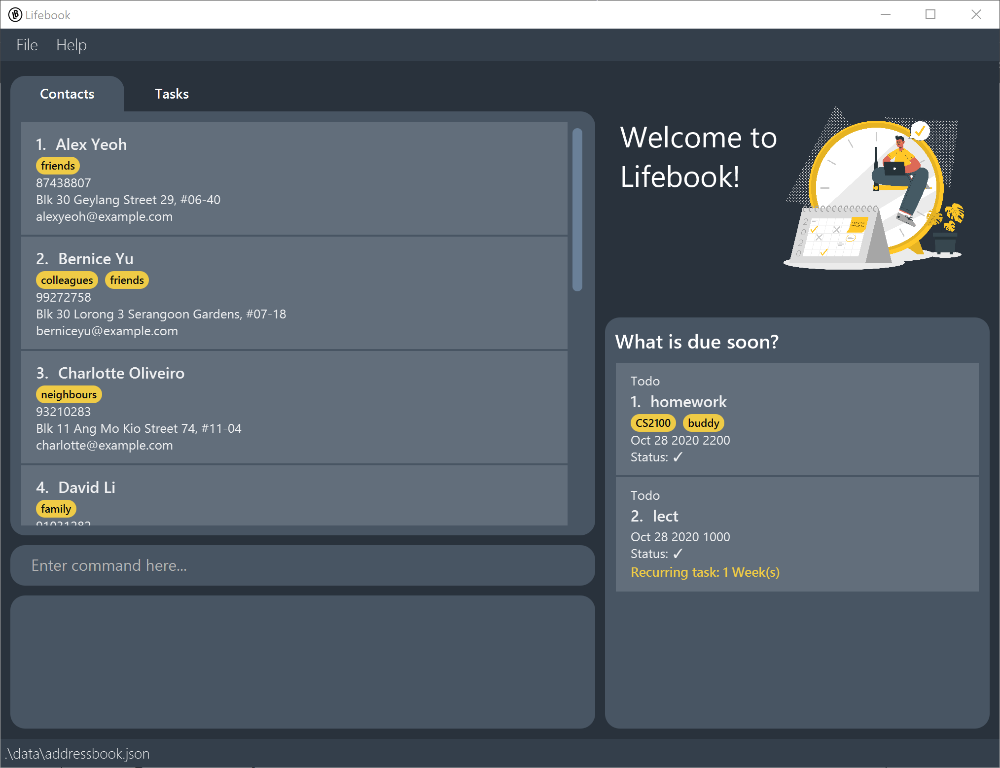
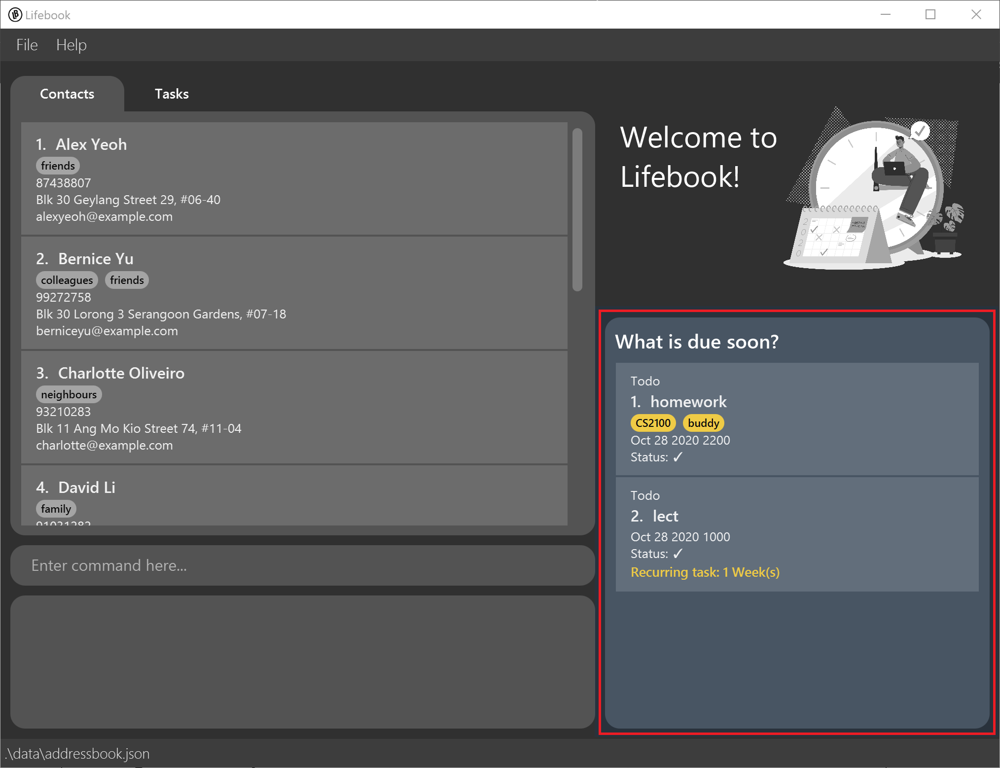
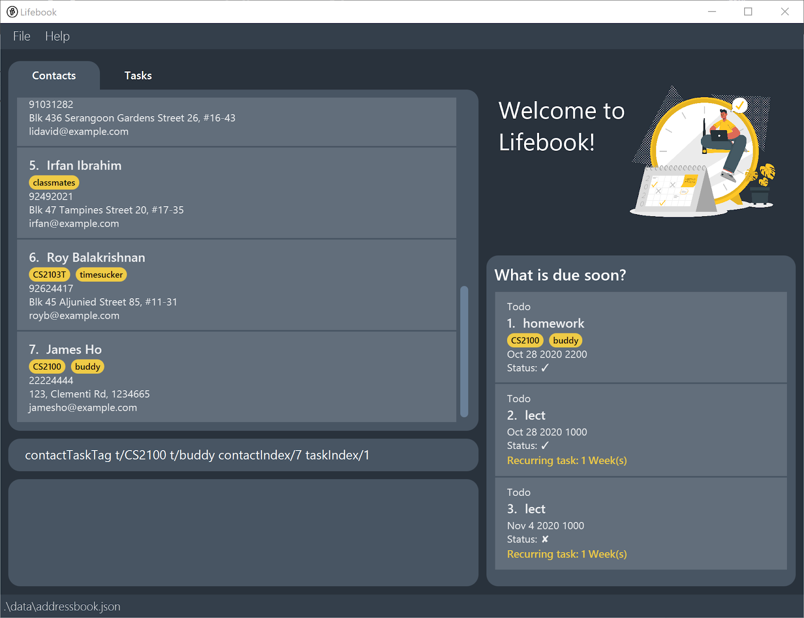

Lifebook is a **desktop application intended for university students to  manage contact details, assignments, projects,
and module details.** Lifebook supports Command Line Interface (CLI) for efficient contacts and tasks management while still having the benefits of a Graphical User Interface (GUI).

This user guide is targeted at university students who are interested in using Lifebook. 

* Table of Contents
{:toc}

--------------------------------------------------------------------------------------------------------------------

## Quick start

1. Ensure you have Java `11` or above installed in your Computer.

1. Download the latest `lifebook.jar` from [here](https://github.com/AY2021S1-CS2103T-F12-4/tp/releases/tag/v1.3a).

1. Copy the file to the folder you want to use as the _home folder_ for your Lifebook.

1. Double-click the file to start the app. You will see that the app initially contains some sample data. 
   

1. Type the command in the command box and press Enter to execute it. e.g. typing **`help`** and pressing Enter will open the help window. 
   Some example commands you can try:

   * **`list contact`** : Lists all contacts.

   * **`add contact`**`n/John Doe p/98765432 e/johnd@example.com a/John street, block 123, #01-01` : Adds a contact named `John Doe` to the contact list.

   * **`add todo`**`desc/homework date/12-12-2020 time/2359`: Adds a todo with a description `homework` that is due by `12 December 2020, 2359`.

   * **`link meeting`**`desc/Annual meeting url/https://nus-sg.zoom.us/j/98401234359?pwd=eG9HU1FJRDdsVHRaYkFUTC95L0abcedf todo i/2 date/20/1/2020 time/2359` : Add a zoom meeting titled 'annual meeting' at 2359, 20 Jan 2020 to the app.

   * **`delete contact`**`3` : Deletes the 3rd contact shown in the current list.

   * **`clear contact`** : Deletes all contacts.

   * **`exit`** : Exits the app.

1. Refer to the [Features](#features) below for details of each command.

--------------------------------------------------------------------------------------------------------------------

## Features

**:information_source: Notes about the command format:** 

* Words in `UPPER_CASE` are the parameters to be supplied by the user. 
  e.g. in `add n/NAME`, `NAME` is a parameter which can be used as `add n/John Doe`.

* Items in square brackets are optional. 
  e.g `n/NAME [t/TAG]` can be used as `n/John Doe t/friend` or as `n/John Doe`.

* Items with `…`​ after them can be used multiple times including zero times. 
  e.g. `[t/TAG]…​` can be used as ` ` (i.e. 0 times), `t/friend`, `t/friend t/family` etc.

* Parameters for contacts can be in any order. 
  e.g. if the command specifies `n/NAME p/PHONE_NUMBER`, `p/PHONE_NUMBER n/NAME` is also acceptable.

### Contact

##### Adding a person: `add contact`

Adds a person to the contact list.

Format: `add  contact n/NAME p/PHONE_NUMBER e/EMAIL a/ADDRESS [t/TAG]…​`

:bulb: **Tip:**
A person can have any number of tags (including 0)

Examples:
* `add contact n/John Doe p/98765432 e/johnd@example.com a/John street, block 123, #01-01`
* `add contact n/Betsy Crowe t/friend e/betsycrowe@example.com a/Newgate Prison p/1234567 t/criminal`

##### Listing all persons : `list contact`

Shows a list of all persons in the contact list.

Format: `list contact`

##### Editing a person : `edit contact`

Edits an existing person in the contact list.

Format: `edit contact i/INDEX [n/NAME] [p/PHONE] [e/EMAIL] [a/ADDRESS] [t/TAG]…​`

* Edits the person at the specified `INDEX`. The index refers to the index number shown in the displayed person list. The index **must be a positive integer** 1, 2, 3, …​
* At least one of the optional fields must be provided.
* Existing values will be updated to the input values.
* When editing tags, the existing tags of the person will be removed i.e adding of tags is not cumulative.
* You can remove all the person’s tags by typing `t/` without
    specifying any tags after it.

Examples:
*  `edit contact i/1 p/91234567 e/johndoe@example.com` Edits the phone number and email address of the 1st person to be `91234567` and `johndoe@example.com` respectively.
*  `edit contact i/2 n/Betsy Crower t/` Edits the name of the 2nd person to be `Betsy Crower` and clears all existing tags.

##### Showing persons with a specific tag: `show contact`
Shows persons whose tags match the tag being searched.

Format: `show contact t/TAG`
* The search is case-insensitive. e.g `friends` will match `Friends`
* Only full words will be matched. e.g. `friend` will not match `friends`
* Persons whose one of the tag(s) matches the tag searched will be returned.
e.g. Hans with tag `friends` and `colleagues` will be returned when tag `friends` is searched.

Examples:
* `show contact t/colleagues`
* `show contact t/friends`

##### Locating person by name: `find contact`

Finds people whose names contain any of the given keywords.

Format: `find contact KEYWORD [MORE_KEYWORDS]`

* The search is case-insensitive. e.g `hans` will match `Hans`
* The order of the keywords does not matter. e.g. `Hans Bo` will match `Bo Hans`
* Only their names is used to compare with the keywords.
* Only full words will be matched e.g. `Han` will not match `Hans`
* Persons matching at least one keyword will be returned (i.e. `OR` search).
  e.g. `Hans Bo` will return `Hans Gruber`, `Bo Yang`

Examples:
* `find contact John` returns `john` and `John Doe`
* `find contact alex david` returns `Alex Yeoh`, `David Li` 

  

##### Deleting a person : `delete contact`

Deletes the specified person from the contact list.

Format: `delete contact INDEX`

* Deletes the person at the specified `INDEX`.
* The index refers to the index number shown in the displayed person list.
* The index **must be a positive integer** 1, 2, 3, …​

Examples:
* `list contact` followed by `delete contact 2` deletes the 2nd person in the contact list.
* `find contact Betsy` followed by `delete contact 1` deletes the 1st person in the results of the `find` command.

##### Clearing all entries : `clear contact`

Clears all entries from the contact list.

Format: `clear contact`

### Task

##### Due soon Tasks

At the bottom right hand corner of Lifebook, a list of tasks is shown that are due **1 week from the current date/time**.

##### Removing Tasks : `delete task`
Removes a To Do or an Event from the TaskList of LifeBook.

Format: `delete task INDEX`

* Removes the To Do at the specified `INDEX`.
* The index refers to the index number shown in the displayed TodoList.
* The index **must be a positive integer** 1, 2, 3, …​

Example:
* `list todo` followed by `delete task 3`  removes the 3rd To Do from the To Do list.
* `list event` followed by `delete task 3`  removes the 3rd Event from the Event list.

##### Mark Task as complete: `done`
Marks a Task on the TaskList as complete.

Format: `done INDEX`

* Marks the Task at the specified `INDEX` as done.
* The index refers to the index number shown in the displayed TaskList.
* The index **must be a positive integer** 1, 2, 3, …​
* If it is a recurring todo or event, it will proceed to add a new Todo or a new Event based on the new deadline given by the recurrence.

Example:
* `list todo` followed by `done 3` marks the 3rd todo on the Todo List as complete.
* `list event` followed by `done 3` marks the 3rd Event on the Event list as complete.

##### Listing all tasks : `list task`

Shows a list of all events and to-dos in the Lifebook.

Format: `list task`

##### Adding a zoom meeting: `link meeting`

Adds a meeting link for an event.

Format:
* `link meeting desc/DESCRIPTION url/MEETING LINK i/INDEX_OF_TODO date/DD-MM-YYYY time/HHmm`

Examples:
* `link meeting desc/Job interview url/https://nus-sg.zoom.us/j/98221234359?pwd=eG9HU1FJRDdsVHRaYk2UTC95L0abcedf i/2 date/22-09-2020 time/1400`

##### Adding a collaborative folder link: `link doc`

Adds a collaborative link (Google Drive, GitHub, Trello, and others) for a todo.

Format:
* `link doc desc/DESCRIPTION url/LINK i/INDEX_OF_TODO`

Examples:
* `link doc desc/CS2103T Team Project url/https://drive.google.com/drive/folders/1zoUz1JpAgynIkfacr0asqV9A4kh i/2`

##### Filter deadlines : `itemsDue`

User can search todos/meetings due by/before a certain date/time.

Outputs a list of results.

* Due by
    `itemsDueBy date/DD-MM-YYYY time/HHmm`

    `DD-MM-YYYY`: States the Day, Month, Year.

    `HHmm`: States the time in 24 hours.

    Example: `itemsDueBy date/12-12-2020 time/2359`
    It will output a list of todos/meetings that are due specifically **on** 12th December 2020, 2359.

* Due before
    `itemsDueBefore date/DD-MM-YYYY time/HHmm`

    `DD-MM-YYYY`: States the Day, Month, Year.

    `HHmm`: States the time in 24 hours.

    Example: `itemsDueBefore date/12-12-2020 time/2359`
    It will output a list of todos/meetings that are due specifically **before** 12th December 2020, 2359.

##### Sorting contacts and tasks: `sort`

Sorts tasks or contacts according to date or name, respectively. Sorting may also be cleared, such that the natural order of lists are restored.

Format: `sort OPTION`

* Contact, task, and clear are the available options for sort and should be used individually.
* Using the clear option restores all lists (i.e. both contact list and task list) to their natural order.

##### Add common tag to contact + task: `contactTaskTag`

Adds a common tag to a contact and task (Todo or Event) based on the given indexes of the contact and task.
The user can choose to add as many common tags as they want, where they simply just need to input the `t/` prefix.

Format:
* `contactTaskTag t/TAG... contactIndex/INDEX taskIndex/INDEX`

Example:

Upon executing the command, the contact at index 7- “James Ho” and task at index 1- “homework” will have both the tags “CS2100” and “buddy”, which helps in the ease of searching contacts that are associated with a task.

* `contactTaskTag t/CS2100 t/buddy contactIndex/7 taskIndex/1`

### Todo

##### Adding To Dos : `add todo`
Adds a To Do to the TodoList of LifeBook.

Format: `add todo desc/DESCRIPTION date/DATE time/TIME [recurring/VALUE UNIT]`

* `DATE` must be specified in the format of DD-MM-YYYY
* `TIME` must be specified in the format of HHmm using 24 hour time
* `VALUE` must be > 0
* `UNIT` must be "day", "week", "month" or "year"

#### Editing a todo : `edit todo`

Edits an existing todo in the task list.

Format: `edit todo i/INDEX [desc/DESCRIPTION] [date/DATE] [time/TIME]`

* Edits the todo at the specified `INDEX`. The index refers to the index number shown in the displayed task list. The index **must be a positive integer** 1, 2, 3, …​
* At least one of the optional fields must be provided.
* Existing values will be updated to the input values.
* `DATE` must be specified in the format of DD-MM-YYYY
* `TIME` must be specified in the format of HHmm using 24 hour time

Examples:
*  `edit todo i/1 desc/CS2101 Slides date/24-01-2020` Edits the description and date of the 1st todo to be `CS2101 Slides` and `24-01-2020` respectively.
*  `edit todo i/2 date/25-01-2020 time/2350` Edits the date and time of the 2nd todo to be `25-01-2020` and `23500` respectively.

##### Recurrence

If a task is recurring, it will be displayed in the GUI.

Examples:

* `add todo desc/cs2101 Oral Presentation reflection date/08-08-2020 time/2359`
* `add todo desc/user guide draft date/09-08-2020 time/2300`
* `add todo desc/tutorial date/10-10-2020 time/1130 recurring/1 week`

##### View all To Dos : `list todo`
Shows a list of all To Do's in the TodoList.

Format: `list todo`

##### Showing todos with a specific tag: `show todo`
Shows todos whose tags match the tag being searched.

Format: `show todo t/TAG`
* The search is case-insensitive. e.g `cs2100` will match `CS2100`
* Only full words will be matched. e.g. `cs210` will not match `cs2100`
* Todos whose one of the tag(s) matches the tag searched will be returned.
e.g. Finish assignment with tag `CS2100` and `Graded` will be returned when tag `CS2100` is searched.

Examples:
* `show todo t/CS2100`
* `show todo t/CS3243`

##### Locating todos by description: `find todo`

Finds todos whose description contain any of the given keywords.

Format: `find todo KEYWORD [MORE_KEYWORDS]`

* The search is case-insensitive. e.g `assignment` will match `Assignment`
* The order of the keywords does not matter. e.g. `Finish assignment` will match `assignment Finish`
* Only the description is searched.
* Only full words will be matched e.g. `Assign` will not match `Assignment`
* Todos matching at least one keyword will be returned (i.e. `OR` search).
  e.g. `Do assignment` will return `Do chores`, `Finish assignment`

Examples:
* `find todo assignment` returns `Essay assignment` and `Quiz assignment`
* `find todo Do assignment` returns `Do chores`, `Finish assignment` 

### Event

##### Adding Events : `add event`
Adds an Event o to the EventList of LifeBook.

Format: `add event desc/DESCRIPTION startdate/DATE starttime/TIME enddate/DATE endtime/TIME [recurring/VALUE UNIT]`

* `DATE` must be specified in the format of DD-MM-YYYY
* `TIME` must be specified in the format of HHmm using 24 hour time
* `VALUE` must be > 0
* `UNIT` must be "day", "week", "month" or "year"

Examples:

* `add event desc/Party with friends startdate/08-08-2020 starttime/2359 enddate/10-08-2020 endtime/2359 recurring/1 year`
* `add event desc/Singapore Fintech Festival startdate/09-08-2020 starttime/1000 enddate/12-08-2020 endtime/2359`

##### Editing an event : `edit event`

Edits an existing event in the task list.

Format: `edit event i/INDEX [desc/DESCRIPTION] [startdate/DATE] [starttime/TIME] [enddate/DATE] [endtime/TIME]`

* Edits the event at the specified `INDEX`. The index refers to the index number shown in the displayed task list. The index **must be a positive integer** 1, 2, 3, …​
* At least one of the optional fields must be provided.
* Existing values will be updated to the input values.
* `STARTDATE` and `ENDDATE` must be specified in the format of DD-MM-YYYY
* `STARTTIME` and `ENDTIME` must be specified in the format of HHmm using 24 hour time

Examples:
*  `edit event i/1 desc/CS2101 Lecture startdate/24-01-2020 endtime/2359` Edits the description, start date, and end time of the 1st event to be `CS2101 LEcture`, `24-01-2020`, and `2359` respectively.
*  `edit event i/2 starttime/1400 enddate/30-01-2020` Edits the start time and end date of the 2nd event to be `1400` and `30-01-2020` respectively.

##### View all Events : `list event`
Shows a list of all Events in the EventList.

Format: `list event`

##### Showing events with a specific tag: `show events`
Shows events whose tags match the tag being searched.

Format: `show event t/TAG`
* The search is case-insensitive. e.g `cs2100` will match `CS2100`
* Only full words will be matched. e.g. `cs210` will not match `cs2100`
* Events whose one of the tag(s) matches the tag searched will be returned.
e.g. Attend meeting with tag `CS2100` and `TeamProject` will be returned when tag `CS2100` is searched.

Examples:
* `show event t/TeamProject`
* `show event t/CS3243`

##### Locating events by description: `find event`

Finds events whose description contain any of the given keywords.

Format: `find event KEYWORD [MORE_KEYWORDS]`

* The search is case-insensitive. e.g `meeting` will match `Meeting`
* The order of the keywords does not matter. e.g. `Attend meeting` will match `meeting Attend`
* Only the description is searched.
* Only full words will be matched e.g. `Meet` will not match `Meeting`
* Events matching at least one keyword will be returned (i.e. `OR` search).
  e.g. `Attend meeting` will return `Attend workshop`, `Arrange meeting`

Examples:
* `find event meeting` returns `CCA meeting` and `Team meeting`
* `find event Attend meeting` returns `Attend workshop`, `Arrange meeting` 

### Others

##### Exiting the program : `exit`

Exits the program.

Format: `exit`

##### Viewing help : `help`

Shows a message explaining how to access the help page.

Format: `help`

--------------------------------------------------------------------------------------------------------------------

## FAQ

**Q**: How do I save any update I made on the Lifebook? 
**A**: Lifebook will automatically save any update you make upon closing the app, and the data is saved in the hard disk. There is no need to save manually. 
**Q**: How do I transfer my data to another Computer? 
**A**: Install the app in the other computer and overwrite the empty data file it creates with the file that contains the data of your previous Lifebook home folder.

--------------------------------------------------------------------------------------------------------------------

## Command summary

### General
Action | Format, Examples
--------|------------------
**Sort** | `sort OPTION`   `OPTION` refers to `contact`, `task`, or `clear`
**Help** | `help`
**Add common tag to Contact + Task** | `contactTaskTag t/TAG... contactIndex/INDEX taskIndex/INDEX`   e.g., `contactTaskTag t/CS2103T t/ProjMate contactIndex/1 taskIndex/1`

### Contact Operations
Action | Format, Examples
--------|------------------
**Add Contact** | `add contact n/NAME p/PHONE_NUMBER e/EMAIL a/ADDRESS [t/TAG]…​`   e.g., `add contact n/James Ho p/22224444 e/jamesho@example.com a/123, Clementi Rd, 1234665 t/friend t/colleague`
**Clear Contacts** | `clear contact`
**Delete Contact** | `delete contact INDEX`  e.g., `delete contact 3`
**Edit Contact** | `edit contact INDEX [n/NAME] [p/PHONE_NUMBER] [e/EMAIL] [a/ADDRESS] [t/TAG]`  e.g.,`edit contact i/2 n/James Lee e/jameslee@example.com`
**Find Contact** | `find contact KEYWORD [MORE_KEYWORDS]`  e.g., `find contact James Jake`
**Show Contact** | `show contact t/TAG`   e.g., `show contact t/friends`
**List Contacts** | `list contact`

### Task Operations
Action | Format, Examples
--------|------------------
**List Tasks** | `list task`
**Remove Task (Todo and Event)** | `delete task INDEX`   e.g., `delete task 3`
**Mark To Do/Event as Complete** | `done INDEX`   e.g., `done 5`
**Find tasks due by** | `itemsDueBy date/DD-MM-YYYY time/HHmm`   e.g. `itemsDueBy date/12-12-2020 time/2359`
**Find tasks due before** |  `itemsDueBefore date/DD-MM-YYYY time/HHmm`   e.g. `itemsDueBefore date/12-12-2020 time/2359`

##### Todo-specific Operations
Action | Format, Examples
--------|------------------
**Add To Do** | `add todo desc/DESCRIPTION date/DATE time/TIME [recurring/VALUE UNIT]`   e.g., `add todo desc/update user guide date/09-08-2020 time/2300 recurring/1 week`
**List To Dos** | `list todo`
**Find To Do** | `find todo KEYWORD [MORE_KEYWORDS]`  e.g., `find todo Finish assignment`
**Show To Do** | `show todo t/TAG`   e.g., `show todo t/CS2100`
**Link doc** | `link doc desc/DESCRIPTION url/LINK i/INDEX_OF_TASK`   e.g.,`link doc desc/CS2103T Team Project url/https://drive.google.com/drive/folders/1zoIkfacr0asqV9A4kh i/2`

##### Event-specific Operations
Action | Format, Examples
--------|------------------
**Add Event** | `add event desc/DESCRIPTION startdate/DATE starttime/TIME enddate/DATE endtime/TIME [recurring/VALUE UNIT]`   e.g., `add event desc/meeting startdate/12-12-2020 starttime/1000 enddate/12-12-2020 endtime/1130 recurring/1 week`
**List Events** | `list event`
**Find Event** | `find event KEYWORD [MORE_KEYWORDS]`  e.g., `find event Attend meeting`
**Show Event** | `show event t/TAG`   e.g., `show event t/CCAMeeting`
**Link meeting** | `link meeting desc/DESCRIPTION url/LINK i/INDEX_OF_TASK`   e.g.,`link meeting desc/Job interview url/https://nus-sg.zoom.us/j/98221234359?pwd=eG9HU1FJRDdsVHRaYk2UTC95L0abcedf i/2 date/22-09-2020 time/1400`

