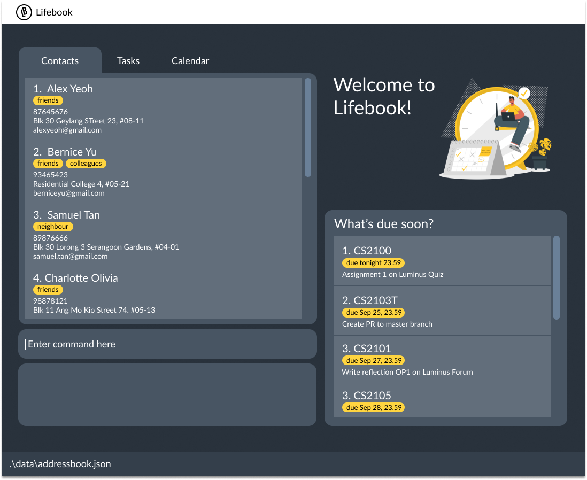

Lifebook is a **desktop application intended for University students to  manage contact details, assignments, projects, 
and module details.** Lifebook supports Command Line Interface (CLI) for efficient contacts and tasks management while still having the benefits of a Graphical User Interface (GUI).

* Table of Contents
{:toc}

--------------------------------------------------------------------------------------------------------------------

## Quick start

1. Ensure you have Java `11` or above installed in your Computer.

1. Download the latest `lifebook.jar` from [here](https://github.com/se-edu/addressbook-level3/releases).

1. Copy the file to the folder you want to use as the _home folder_ for your Lifebook.

1. Double-click the file to start the app. The GUI similar to the below should appear in a few seconds. Note how the app contains some sample data. 
   

1. Type the command in the command box and press Enter to execute it. e.g. typing **`help`** and pressing Enter will open the help window. 
   Some example commands you can try:

   * **`list contact`** : Lists all contacts.

   * **`add contact`**`n/John Doe p/98765432 e/johnd@example.com a/John street, block 123, #01-01` : Adds a contact named `John Doe` to the contact list.

   * **`link meeting`**`desc/Annual meeting url/https://nus-sg.zoom.us/j/98401234359?pwd=eG9HU1FJRDdsVHRaYkFUTC95L0abcedf todo i/2 date/20/1/2020 time/2359` : Add a zoom meeting titled 'annual meeting' at 2359, 20 Jan 2020 to the app.

   * **`delete contact`**`3` : Deletes the 3rd contact shown in the current list.

   * **`clear contact`** : Deletes all contacts.

   * **`exit`** : Exits the app.

1. Refer to the [Features](#features) below for details of each command.

--------------------------------------------------------------------------------------------------------------------

## Features

**:information_source: Notes about the command format:** 

* Words in `UPPER_CASE` are the parameters to be supplied by the user. 
  e.g. in `add n/NAME`, `NAME` is a parameter which can be used as `add n/John Doe`.

* Items in square brackets are optional. 
  e.g `n/NAME [t/TAG]` can be used as `n/John Doe t/friend` or as `n/John Doe`.

* Items with `…`​ after them can be used multiple times including zero times. 
  e.g. `[t/TAG]…​` can be used as ` ` (i.e. 0 times), `t/friend`, `t/friend t/family` etc.

* Parameters can be in any order. 
  e.g. if the command specifies `n/NAME p/PHONE_NUMBER`, `p/PHONE_NUMBER n/NAME` is also acceptable.

### Viewing help : `help`

Shows a message explaning how to access the help page.

Format: `help`

### Adding a person: `add contact`

Adds a person to the contact list.

Format: `add  contact n/NAME p/PHONE_NUMBER e/EMAIL a/ADDRESS [t/TAG]…​`

:bulb: **Tip:**
A person can have any number of tags (including 0)

Examples:
* `add contact n/John Doe p/98765432 e/johnd@example.com a/John street, block 123, #01-01`
* `add contact n/Betsy Crowe t/friend e/betsycrowe@example.com a/Newgate Prison p/1234567 t/criminal`

### Adding a zoom meeting: `link meeting`

Adds a zoom link for a task.

Format: 
* `link meeting desc/DESCRIPTION url/MEETING LINK todo i/INDEX_OF_TODO date/DD/MM/YYYY time/HHmm` or
* `link meeting desc/DESCRIPTION url/MEETING LINK event i/INDEX_OF_EVENT date/DD/MM/YYYY time/HHmm`

Examples:
* `link meeting desc/Job interview url/https://nus-sg.zoom.us/j/98221234359?pwd=eG9HU1FJRDdsVHRaYk2UTC95L0abcedf event i/2 date/22/9/2020 time/1400`

### Adding a collaborative folder link: `link doc`

Adds a collaborative link (Google Drive, GitHub, Trello, and others)

Format: 
* `link doc desc/DESCRIPTION url/LINK todo i/INDEX_OF_TODO` or
* `link doc desc/DESCRIPTION url/LINK event i/INDEX_OF_EVENT`

Examples:
* `link doc desc/CS2103T Team Project url/https://drive.google.com/drive/folders/1zoUz1JpAgynIkfacr0asqV9A4kh todo i/2`

### Filter deadlines : `items due`

User can search todos/meetings due by/before a certain date/time.

Outputs a list of results.

* Due by
    `items due by/DD/MM/YYYY [HHmm]`

    `DD/MM/YYYY`: States the Day, Month, Year.

    `HHmm`: States the time in 24 hours.

    Example: `items due by/25/9/2020 2359`
    It will output a list of todos/meetings that are due specifically **on** 25th September 2020, 2359.

* Due before
    `items due before/DD/MM/YYYY [HHmm]`

    `DD/MM/YYYY`: States the Day, Month, Year.

    `HHmm`: States the time in 24 hours.

    Example: `items due before/25/9/2020 2359`
    It will output a list of todos/meetings that are due specifically **before** 25th September 2020, 2359.

### Listing all persons : `list contact`

Shows a list of all persons in the contact list.

Format: `list contact`

### Editing a person : `edit contact`

Edits an existing person in the contact list.

Format: `edit contact INDEX [n/NAME] [p/PHONE] [e/EMAIL] [a/ADDRESS] [t/TAG]…​`

* Edits the person at the specified `INDEX`. The index refers to the index number shown in the displayed person list. The index **must be a positive integer** 1, 2, 3, …​
* At least one of the optional fields must be provided.
* Existing values will be updated to the input values.
* When editing tags, the existing tags of the person will be removed i.e adding of tags is not cumulative.
* You can remove all the person’s tags by typing `t/` without
    specifying any tags after it.

Examples:
*  `edit contact 1 p/91234567 e/johndoe@example.com` Edits the phone number and email address of the 1st person to be `91234567` and `johndoe@example.com` respectively.
*  `edit contact 2 n/Betsy Crower t/` Edits the name of the 2nd person to be `Betsy Crower` and clears all existing tags.

### Showing persons with a specific tag: `show`
Shows persons whose tags match the tag being searched.

Format: `show tag [t/TAG]`
* The search is case-insensitive. e.g `friends` will match `Friends`
* Only full words will be matched. e.g. `friend` will not match `friends`
* Persons whose one of the tag(s) matches the tag searched will be returned.
e.g. Hans with tag `friends` and `colleagues` will be returned when tag `friends` is searched.

Examples:
* `show tag t/colleagues` 
* `show tag t/friends`

### Locating persons by name: `find contact`

Finds persons whose names contain any of the given keywords.

Format: `find contact KEYWORD [MORE_KEYWORDS]`

* The search is case-insensitive. e.g `hans` will match `Hans`
* The order of the keywords does not matter. e.g. `Hans Bo` will match `Bo Hans`
* Only the name is searched.
* Only full words will be matched e.g. `Han` will not match `Hans`
* Persons matching at least one keyword will be returned (i.e. `OR` search).
  e.g. `Hans Bo` will return `Hans Gruber`, `Bo Yang`

Examples:
* `find contact John` returns `john` and `John Doe`
* `find contact alex david` returns `Alex Yeoh`, `David Li` 

  

### Deleting a person : `delete contact`

Deletes the specified person from the contact list.

Format: `delete contact INDEX`

* Deletes the person at the specified `INDEX`.
* The index refers to the index number shown in the displayed person list.
* The index **must be a positive integer** 1, 2, 3, …​

Examples:
* `list contact` followed by `delete contact 2` deletes the 2nd person in the contact list.
* `find contact Betsy` followed by `delete contact 1` deletes the 1st person in the results of the `find` command.

### Clearing all entries : `clear contact`

Clears all entries from the contact list.

Format: `clear contact`

### Exiting the program : `exit`

Exits the program.

Format: `exit`

### Saving the data

Lifebook data are saved in the hard disk automatically after any command that changes the data. There is no need to save manually.

### Archiving data files 

This feature will be implemented in the next iteration (v1.2).

### Adding To Do's : `todo`
Adds a To Do to the TodoList of LifeBook.

Format: `todo desc/DESCRIPTION date/DATE time/TIME`

* `DATE` must be specified in the format of DD/MM/YYYY
* `TIME` must be speficied in the format of HHmm using 24 hour time

Examples:

* `todo finish desc/cs2101 Oral Presentation reflection date/08/08/2020 time/2359`
* `todo finish user guide draft date/09/08/2020 time/2300`

### View all To Do's : `list todo`
Shows a list of all To Do's in the TodoList.

Format: `list todo`

### Removing To Do's : `remove todo`
Removes a To Do from the TodoList of LifeBook.

Format: `remove todo i/INDEX`

* Removes the To Do at the specified `INDEX`.
* The index refers to the index number shown in the displayed TodoList.
* The index **must be a positive integer** 1, 2, 3, …​

Example:
* `list todo` followed by `remove todo i/3`  removes the 3rd To Do from the To Do list.

### View details of a specific To Do: `show todo`
Shows all details of a specific To Do on the TodoList.

Format: `show todo i/INDEX`

* Shows all details of the To Do at the specified `INDEX`.
* The index refers to the index number shown in the displayed TodoList.
* The index **must be a positive integer** 1, 2, 3, …​

Example:
* `list todo` followed by `show todo i/3`  shows all details of the 3rd To Do on the To Do list.

### Mark To Do as complete: `done`
Marks a To Do on the TodoList as complete.

Format: `done i/INDEX`

* Marks the To Do at the specified `INDEX` as done.
* The index refers to the index number shown in the displayed TodoList.
* The index **must be a positive integer** 1, 2, 3, …​

Example:
* `list todo` followed by `done todo i/3`  marks the 3rd To Do on the To Do list as complete.

--------------------------------------------------------------------------------------------------------------------

## FAQ

**Q**: How do I transfer my data to another Computer? 
**A**: Install the app in the other computer and overwrite the empty data file it creates with the file that contains the data of your previous Lifebook home folder.

--------------------------------------------------------------------------------------------------------------------

## Command summary

Action | Format, Examples
--------|------------------
**Add** | `add n/NAME p/PHONE_NUMBER e/EMAIL a/ADDRESS [t/TAG]…​`   e.g., `add n/James Ho p/22224444 e/jamesho@example.com a/123, Clementi Rd, 1234665 t/friend t/colleague`
**Clear** | `clear`
**Delete** | `delete INDEX`  e.g., `delete 3`
**Edit** | `edit INDEX [n/NAME] [p/PHONE_NUMBER] [e/EMAIL] [a/ADDRESS] [t/TAG]`  e.g.,`edit 2 n/James Lee e/jameslee@example.com`
**Find** | `find KEYWORD [MORE_KEYWORDS]`  e.g., `find James Jake`
**List** | `list`
**Help** | `help`
**Add To Do** | `todo desc/DESCRIPTION date/DATE time/TIME`   e.g., `todo finish user guide draft date/09/08/2020 time/2300`
**List To Do** | `list todo`
**Remove To Do** | `remove todo i/INDEX`   e.g., `remove todo i/3`
**Show To Do** | `show todo i/INDEX`   e.g., `show todo 3`
**Show Tag** | `show tag t/TAG`   e.g., `show tag t/friends`
**Mark To Do as Complete** | `done i/INDEX`   e.g., `done 5`
**Filter by** | `items due by/DD/MM/YYYY [HHmm]`   e.g. `items due by/21/10/2020`
**Filter before** |  `items due before/DD/MM/YYYY [HHmm]`   e.g. `items due before/21/10/2020 2359`
**Link meeting** | `link meeting desc/DESCRIPTION url/LINK todo/event i/INDEX_OF_TASK`   e.g.,`link meeting desc/Job interview url/https://nus-sg.zoom.us/j/98221234359?pwd=eG9HU1FJRDdsVHRaYk2UTC95L0abcedf event i/2 date/22/9/2020 time/1400`
**Link doc** | `link doc desc/DESCRIPTION url/LINK todo/event i/INDEX_OF_TASK`   e.g.,`link doc desc/CS2103T Team Project url/https://drive.google.com/drive/folders/1zoIkfacr0asqV9A4kh todo i/2`
