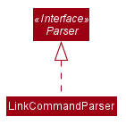
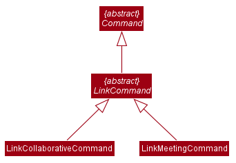
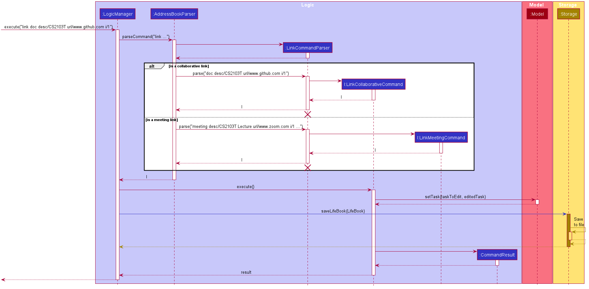
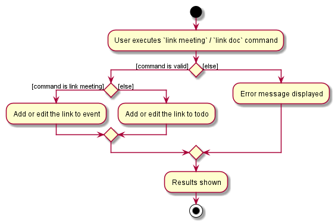
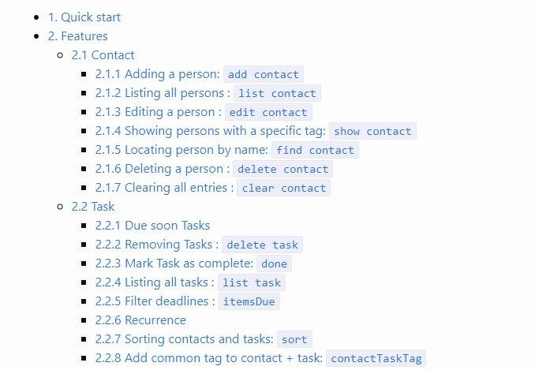
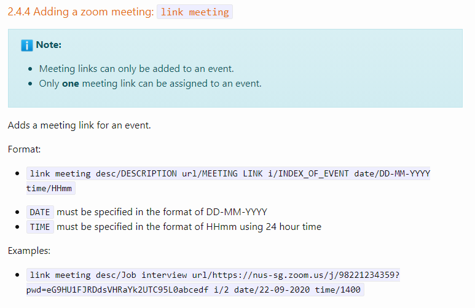

## Project: Lifebook

Lifebook is a desktop task management application used for teaching Software Engineering principles. The user interacts with it using a CLI, and it has a GUI created with JavaFX. It is written in Java, and has about 10 kLoC.

Given below are my contributions to the project.

* **Link Feature**: Added the ability to add a link to a task. (Pull requests [\#86](https://github.com/AY2021S1-CS2103T-F12-4/tp/pull/86), [\#100](https://github.com/AY2021S1-CS2103T-F12-4/tp/pull/100))
  * What it does: allows the user to add a meeting link or collaborative link to a task.
  * Justification: This feature improves the product significantly because finding Zoom links or Google Drive links can be tedious for the users and the app should provide a convenient way for the users to find the links easily.
  * Highlights: This enhancement affects the model of the task. The implementation was quite challenging as UI matters must also be taken into consideration.

* **Edit Task Feature**: Added the ability to edit the properties of a task. (Pull request [\#135](https://github.com/AY2021S1-CS2103T-F12-4/tp/pull/135))
  * What it does: allows the user to edit the properties of a todo or an event.
  * Justification: This feature improves the product significantly because a user can make mistake when typing the properties of a task and the app should provide a convenient way for the users to edit them.
  * Highlights: This enhancement does not affect other commands because it is independent from other commands.

* **Code contributed**: [RepoSense link](https://nus-cs2103-ay2021s1.github.io/tp-dashboard/#breakdown=true&search=kevnw&sort=groupTitle&sortWithin=title&since=2020-08-14&timeframe=commit&mergegroup=&groupSelect=groupByRepos&checkedFileTypes=docs~functional-code~test-code~other)

* **Project management**:
  * Setting up the GitHub team organization
  * Created the skeleton and morph the commands to suite Lifebook (Pull request [\#45](https://github.com/AY2021S1-CS2103T-F12-4/tp/pull/45))
  * Maintaining the issue tracker for every Milestone from `v.1` - `v1.4`

* **Enhancements to existing features**:
  * Updated exception handling for list, add, and delete command to be more meaningful (Pull request [\#79](https://github.com/AY2021S1-CS2103T-F12-4/tp/pull/79))
  * Added extra validation and meaningful exception handling for link (Pull request [\#104](https://github.com/AY2021S1-CS2103T-F12-4/tp/pull/104))
  * Updated the GUI for Meeting Link and Collaborative Link (Pull requests [\#86](https://github.com/AY2021S1-CS2103T-F12-4/tp/pull/86/))
  * Wrote additional tests for existing features to increase coverage from 58% to 67% (Pull requests [\#213](https://github.com/AY2021S1-CS2103T-F12-4/tp/pull/213), [\#214](https://github.com/AY2021S1-CS2103T-F12-4/tp/pull/214), [\#208](https://github.com/AY2021S1-CS2103T-F12-4/tp/pull/208), [\#149](https://github.com/AY2021S1-CS2103T-F12-4/tp/pull/149))

* **Documentation**:
  * User Guide:
    * Added documentation for the features `add event`, `add todo`, `link`, and many more. [\#57](https://github.com/AY2021S1-CS2103T-F12-4/tp/pull/57/)
    * Did cosmetic tweaks to existing documentation of features `edit`, `delete`: [\#137](https://github.com/AY2021S1-CS2103T-F12-4/tp/pull/137/)
    * Added CodeCoverage widget to the User Guide. [\#151](https://github.com/AY2021S1-CS2103T-F12-4/tp/pull/151)
    * Major User Guide fix after the PE-Dry Run. [\#193](https://github.com/AY2021S1-CS2103T-F12-4/tp/pull/193)
  * Developer Guide:
    * Added user stories and use case for the `link` feature. [\#42](https://github.com/AY2021S1-CS2103T-F12-4/tp/pull/42/)
    * Added implementation details of the `link` feature. [\#116](https://github.com/AY2021S1-CS2103T-F12-4/tp/pull/116/)
    * Added UML diagrams for `link` feature. [\#116](https://github.com/AY2021S1-CS2103T-F12-4/tp/pull/116/)
    * Added user stories and use case for `edit` feature. [\#251](https://github.com/AY2021S1-CS2103T-F12-4/tp/pull/251/)
    * Added UML diagrams for `edit` feature. [\#251](https://github.com/AY2021S1-CS2103T-F12-4/tp/pull/251/)

* **Contributions to the Developer Guide**:

    * LinkCommandParser Class Diagram

        

    * LinkCommand Class Diagram

        

    * Sequence Diagram of Link Feature

        

    * Activity Diagram of Link Feature

        

* **Contributions to the User Guide**:

    * Table of Contents numbering

        

    * Link Command

        

    * And others

* **Community**:
  * PRs reviewed (with non-trivial review comments): [\#98](https://github.com/AY2021S1-CS2103T-F12-4/tp/pull/98), [\#69](https://github.com/AY2021S1-CS2103T-F12-4/tp/pull/69), [\#134](https://github.com/AY2021S1-CS2103T-F12-4/tp/pull/134), [\#132](https://github.com/AY2021S1-CS2103T-F12-4/tp/pull/132)
  * Reported bugs and suggestions for other teams in the class (examples: [1](https://github.com/AY2021S1-CS2103T-T15-3/tp/issues/231), [2](https://github.com/AY2021S1-CS2103T-T15-3/tp/issues/233), [3](https://github.com/AY2021S1-CS2103T-T15-3/tp/issues/235))

* **Tools**:
  * Integrated a new Github pulgin (GuardRails) to the team repo
  * Integrated a new Github plugin (CommitCheck) to the team repo

