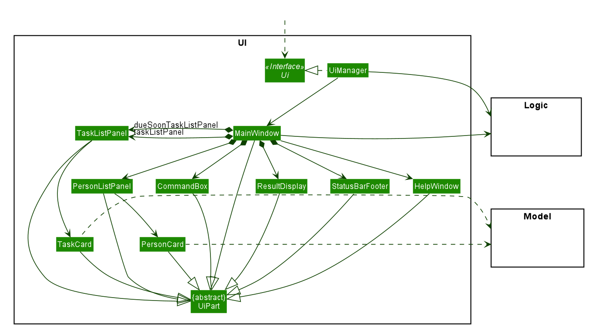
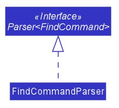
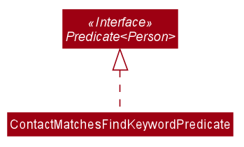
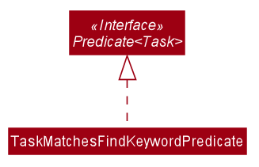
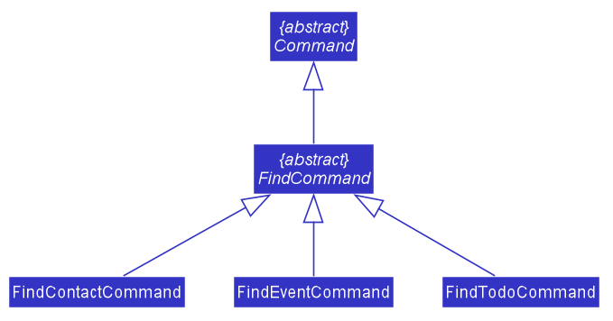
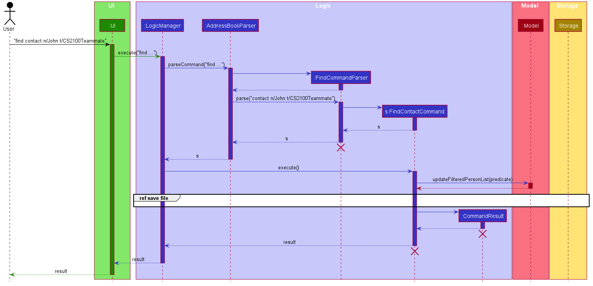
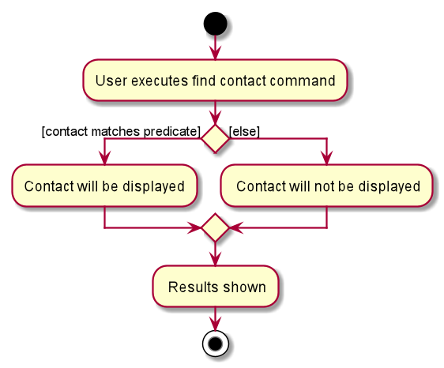
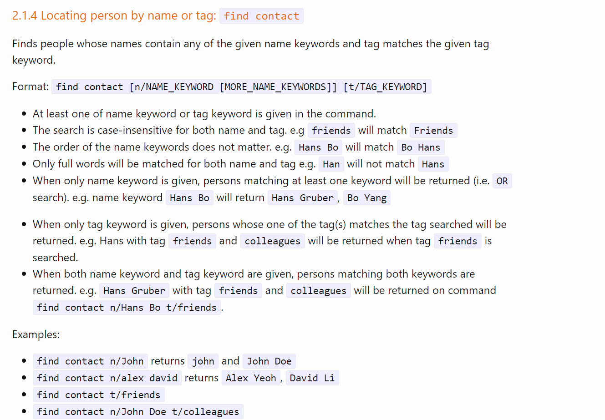

## Project: Lifebook

Lifebook is a desktop task management application created as an assignment for a module that teaches Software Engineering principles. The user interacts with it using a CLI, and it has a GUI created with JavaFX. It is written in Java, and has about 13 kLoC.

Given below are my contributions to the project.

* **Tagging of task**: Added tag field to `Tasks`, and include the tags during the creation of `Task`. ([\#107](https://github.com/AY2021S1-CS2103T-F12-4/tp/pull/107))
  * What it does: allows the user to add tags to `Todos` or `Events` during object creation and keep a record of them as the attribute of `Task` in the `TaskList`.
  * Justification: allows user to label their tasks for better task organisation.
  * Credits: inspired from the tagging of task in Duke.

* **Find Contacts by Name or Tag, Find Events or Todos by Description or Tag**: Implemented the ability for users to find particular `Contacts`, `Events`, or `Todos` by name/description/tag. ([\#200](https://github.com/AY2021S1-CS2103T-F12-4/tp/pull/200), [\#109](https://github.com/AY2021S1-CS2103T-F12-4/tp/pull/109), [\#80](https://github.com/AY2021S1-CS2103T-F12-4/tp/pull/80), [\#55](https://github.com/AY2021S1-CS2103T-F12-4/tp/pull/55)). Find tag was previously show tag, but  then later merged with find name feature as suggested in the mock PE issue [\#180](https://github.com/AY2021S1-CS2103T-F12-4/tp/issues/180)
  * What it does: allows the user to find `Contact` by name or tag, and `Events` or `Todos` by description or tag.
  * Justification:  allows user to easily find a specific contact or task.
  * Highlights: this requires predicate that can handle filter by name/description only, filter by tag only, and filter by both name/description and tag depending on the user input.
  * Credits: inspired from find contact by name from AddressBook 3.

* **Overall GUI Layout and Styling**: Change the GUI theme, style the UI components to follow the layout in the previously designed mock UI. ([\#130](https://github.com/AY2021S1-CS2103T-F12-4/tp/pull/130), [\#82](https://github.com/AY2021S1-CS2103T-F12-4/tp/pull/82), [\#76](https://github.com/AY2021S1-CS2103T-F12-4/tp/pull/76), [\#56](https://github.com/AY2021S1-CS2103T-F12-4/tp/pull/56))
  * What it does: Organise contacts and task in the tab panel which can automatically navigate to the corresponding tab on command execution, organise the panels with grid for better UI, make the UI responsive
  * Justification:  allows users to easily access the contact and task by displaying the UI in a nice layout and style.
  * Highlights: made it easier for the developing team to visualise any features that they may have implemented. Implementing this GUI was challenging at first due to my unfamiliarity with JavaFx. The auto navigation of the tab panel requires additional field in the Command Result to indicate the tab a command corresponds to.
  * Credits: the initial GUI implementation for the `TaskList` was inspired by the GUI of the AddressBook.

* **Code contributed**: [RepoSense link](https://nus-cs2103-ay2021s1.github.io/tp-dashboard/#breakdown=true&search=&sort=groupTitle&sortWithin=title&since=2020-08-14&timeframe=commit&mergegroup=&groupSelect=groupByRepos&checkedFileTypes=docs~functional-code~test-code~other&tabOpen=true&tabType=authorship&tabAuthor=luciatirta&tabRepo=AY2021S1-CS2103T-F12-4%2Ftp%5Bmaster%5D&authorshipIsMergeGroup=false&authorshipFileTypes=docs~functional-code~test-code)

* **Project management**:
  * Authored, tracked and closed issues on Github
  * Reviewed PRs on GitHub

* **Enhancements to existing features**:
  * Provide more meaningful error message, add exception handling to edit command and link command. [\#136](https://github.com/AY2021S1-CS2103T-F12-4/tp/pull/136)
  * Add testing to the command parser that increase code coverage from 69% to 71% [\#253](https://github.com/AY2021S1-CS2103T-F12-4/tp/pull/253)

* **Documentation**:
  * User Guide:
    * Added documentation for the features: `find contact`, `find todo`, `find event`. [\#221](https://github.com/AY2021S1-CS2103T-F12-4/tp/pull/221), [\#40](https://github.com/AY2021S1-CS2103T-F12-4/tp/pull/40), [\#36](https://github.com/AY2021S1-CS2103T-F12-4/tp/pull/36)
  * Developer Guide:
    * Added implementation details, use cases, diagram of the `find contact`, `find todo`, `find event` feature. [\#223](https://github.com/AY2021S1-CS2103T-F12-4/tp/pull/223), [\#111](https://github.com/AY2021S1-CS2103T-F12-4/tp/pull/111), [\#41](https://github.com/AY2021S1-CS2103T-F12-4/tp/pull/41)
    * Updated the architecture diagram to include the updated UI components of Lifebook. [\#244](https://github.com/AY2021S1-CS2103T-F12-4/tp/pull/244)
    * Added manual testing of the find command [\#280](https://github.com/AY2021S1-CS2103T-F12-4/tp/pull/280)

* **Community**:
  * PRs reviewed and merged: [\#239](https://github.com/AY2021S1-CS2103T-F12-4/tp/pull/239), [\#234](https://github.com/AY2021S1-CS2103T-F12-4/tp/pull/234), [\#207](https://github.com/AY2021S1-CS2103T-F12-4/tp/pull/207), [\#78](https://github.com/AY2021S1-CS2103T-F12-4/tp/pull/78), [\#54](https://github.com/AY2021S1-CS2103T-F12-4/tp/pull/54).
  * Reported bugs and suggestions for other teams in the class (examples: [\#1](https://github.com/luciatirta/ped/issues/1), [\#2](https://github.com/Caleblyx/ped/issues/2), [\#3](https://github.com/Caleblyx/ped/issues/3))

* **Other contributions**:
  * Designed the Mock UI using [Figma](https://www.figma.com/file/B1tC0wFEH80wViZf6EQCId/Lifebook?node-id=0%3A1).
  * Contributed to the creation of Lifebook's demonstration video (script, voiceover, and video editing).

* **Contributions to the Developer Guide**:

    * Ui Class Diagram

        

    * FindCommandParser Class Diagram

        
        
    * Predicate Diagram
    
        
        

    * FindCommand Class Diagram

        

    * Sequence Diagram of Find Command Feature

        
        

    * Activity Diagram of Find Command Feature

        
        
* **Contributions to the User Guide**:

    * Find Contact Command 

        
    
    * Find Event and Find Todo Commands have similar usage as the command above.
